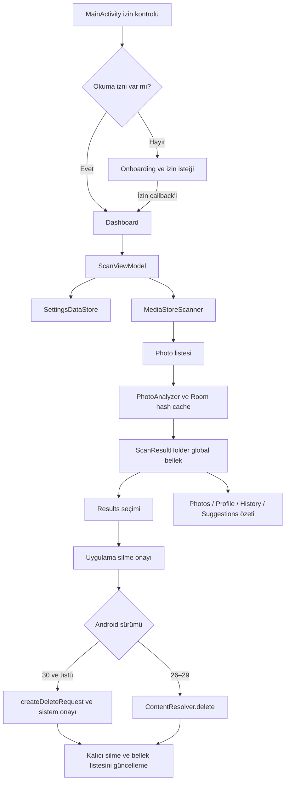

# PhotoClarityAI — Mevcut Durum Analizi ve Geliştirme Yol Haritası

**İnceleme tarihi:** 3 Ekim 2026, Europe/Istanbul.\
**İncelenen kök:** `C:\Users\<USER>\AndroidProjects2\stitch_budget_management_system\PhotoClarityAI`\
**Kapsam:** Mevcut uygulamanın kod, yapılandırma, kaynak, veri akışı, build ve risk analizi. Bu belge geliştirme uygulaması değildir. Kaynak kodu, Gradle sürümleri, manifest, resource ve uygulama davranışı değiştirilmemiştir. Commit/push yapılmamıştır. Build kontrolleri yalnızca üretilen çıktıları ve araç önbelleklerini güncellemiştir.

**Kanıt seviyeleri:** “Kodda doğrulandı” kaynak/konfigürasyon takibiyle; “komutla doğrulandı” bu incelemede çalıştırılan kontrolle; “risk/çıkarım” olası sonuç için; “manuel doğrulanmalı” cihaz, Play Console veya gerçek veri gerektiren konular için kullanılır. Implement edilmiş olmak, cihazda başarılı çalıştığının doğrulandığı anlamına gelmez. Performans tahminleri ölçülmüş benchmark değildir.

Bu belgedeki proje içi yollar yukarıdaki köke göredir. Kotlin kod kökü `app/src/main/java/com/photoclarity/ai/` olup aşağıda `K/` kısaltmasıyla gösterilir. Bulguların numaraları sonraki geliştirme işlerini ve kabul kriterlerini takip etmek için sabittir.

## 1. Executive Summary

PhotoClarityAI sıfırdan başlanması gereken boş bir proje değildir. Tek Android modülünde Kotlin, Jetpack Compose, Material 3, Hilt, Room, DataStore ve coroutine kullanan, fotoğraf tarama ve sonuç seçimi hattı bulunan mevcut bir uygulamadır. 63 Kotlin dosyası, yaklaşık 6.716 kaynak satırı ve 9 Android XML resource dosyası incelenmiştir. Uygulama Java kaynak içermez; `java/` dizini Kotlin dosyalarının bulunduğu geleneksel kaynak dizinidir.

Gerçek analiz cihazda yapılır: MediaStore metadata listesi → byte hash / algısal hash → kalite puanı → tam kopya, görsel benzer, seri çekim ve isteğe bağlı düşük kalite grupları → seçim → MediaStore üzerinden silme. Öğrenilmiş bir AI modeli, ML Kit, TensorFlow, embedding veya sunucu analizi yoktur. “AI” ekran metinleri mevcut deterministik hash ve heuristiklere verilen ürün adıdır.

**Genel durum: geliştirilmiş bir prototip/MVP temeli; production-ready değildir.** Derlenebilirlik ile kullanıcı verisinin güvenli yönetilmesi aynı değerlendirme değildir. En kritik engeller:

| Kimlik | Öncelik | Bulgu ve etkisi | Ana kanıt |
|---|---|---|---|
| R01 | P0 | Geri dönüşüm ekranı 30 gün saklama vaat ediyor; gerçek yol kalıcı silme. Kullanıcı yanlış geri alınabilirlik varsayımıyla fotoğraf kaybedebilir. | `K/ui/trash/TrashScreen.kt`, `K/data/repository/PhotoRepositoryImpl.kt:43`, `K/ui/components/DeleteConfirmDialog.kt` |
| R02 | P0 | Düşük kalite fotoğrafları ilişkileri olmadan tek grupta toplanıyor; “akıllı seç” grupta biri dışındakileri silmeye seçiyor. Bozuk/okunamayan görüntüler de 0 netlik puanıyla buraya düşebilir. | `K/core/analysis/PhotoAnalyzer.kt:122`, `K/ui/results/ResultsViewModel.kt:66` |
| R03 | P1 | `openInputStream()` null dönerse MD5/SHA-256 boş girdinin hash'ini başarı gibi döndürüyor; farklı erişilemeyen dosyalar “tam kopya” olabilir. | `K/core/hash/CryptographicHasher.kt` |
| R04 | P1 | Cache sadece URI + değiştirilme zamanı + boyuta bakıyor. Algoritma/seçenek değişiminde eksik hash'ler tamamlanmıyor; sonuçlar sessizce kaybolabiliyor. | `K/core/analysis/PhotoAnalyzer.kt:183`, `K/data/local/db/HashCacheDao.kt` |
| R05 | P1 | Algoritma tek enum. MD5/SHA-256 seçiliyken görsel hash hesaplanabiliyor, fakat görsel karşılaştırmanın `else` kolu daima false. | `K/core/analysis/PhotoAnalyzer.kt:198`, `:293` |
| R06 | P1 | Benzerlik O(n²), DCT pahalı, karşılaştırmada iptal kontrolü yok. Büyük galeride uzun süre/batarya/tutarsız ilerleme riski. | `K/core/analysis/PhotoAnalyzer.kt:280`, `K/core/hash/PerceptualHasher.kt` |
| R07 | P1 | Android 8–10 silme hataları yutuluyor; başarısız fotoğraflar da sonuçlardan çıkarılabiliyor. Android 10 kullanıcı onaylı scoped-storage recovery yok. | `K/data/repository/PhotoRepositoryImpl.kt:59`, `K/ui/results/ResultsViewModel.kt:76` |
| R08 | P1 | Sonuçlar yalnızca global mutable nesnede. Process death'te kayıp; ekranlar ortak, gözlemlenebilir sonuç kaynağı kullanmıyor. | `K/ui/scan/ScanViewModel.kt:45` ve `ScanResultHolder` tüketicileri |
| R09 | P1 | Android 14 seçili fotoğraf erişimi/reselection açıkça ele alınmıyor; izin değişikliğinden sonra state/cache yenileme yok. | `MainActivity`, `OnboardingScreen`, manifest |
| R10 | P1 | target/compile SDK 34; 3 Ekim 2026 tarihindeki normal yeni uygulama/güncelleme Play şartı API 36. | `app/build.gradle.kts`, [resmî hedef API politikası](https://support.google.com/googleplay/android-developer/answer/11926878?hl=en-EN) |
| R11 | P1 | Test kaynağı yok; release signing/CI ve gerçek cihaz doğrulaması yok. Wrapper JAR eksik, taşınabilir build başlangıcı bozuk. | `app/src`, Gradle dosyaları, komut sonuçları |

P0: veri kaybı/yanıltıcı güvenlik vaadi, release'i engeller. P1: doğruluk, stabilite veya yayın engeli; beta/release öncesi kapatılmalı. P2: önemli kullanılabilirlik/bakım sorunu. P3: düşük etkili temizlik. Bunlar dışarıdan uygulanmış bir güvenlik skoru değil, bu analiz için önceliklendirmedir.

**Build özeti:** Normal wrapper başlangıcı eksik JAR nedeniyle başarısız. Yereldeki Gradle 8.7 ve JBR 21 ile debug APK ve release AAB başarıyla üretildi; AAB imzasızdır. LintDebug 0 hata, 56 uyarıyla tamamlandı. Unit-test görevi test kaynağı olmadığından `NO-SOURCE`; test başarısı olarak yorumlanamaz. Ayrıntılar bölüm 12'dedir. ADB listesinde bağlı cihaz yoktur.

## 2. Uygulamanın Amacı ve Mevcut Kullanıcı Akışı

Amaç, erişilebilir yerel fotoğraflarda temizlik adayları bulmaktır; mevcut uygulama tüm galeriyi gezilebilir bir galeri yöneticisi değildir.

1. `PhotoClarityApp` Hilt uygulamasını başlatır. `MainActivity` splash kurar, edge-to-edge açar ve temayı **zorla karanlık** seçer.
2. İlk rota, o anda READ_MEDIA_IMAGES (API 33+) veya READ_EXTERNAL_STORAGE izninin sonucuyla `remember` içinde belirlenir. Ayrı “onboarding tamamlandı” kaydı yoktur. İzin zaten varsa üç tanıtım sayfası atlanır.
3. `OnboardingScreen` üç tanıtım sayfası ve izin düğmesi gösterir. İzin callback'inde bir izin true ise Dashboard'a gider. Ret, kalıcı ret, sınırlı erişim ve ayarlara yönlendirme için ayrı UX yoktur.
4. Dashboard dahili diskin `StatFs` doluluk bilgilerini, erişilebilir fotoğraf sayısını ve DataStore aylık temizlenen baytı gösterir. “Kopyalar” ve “Benzerler” aynı Results rotasına gider, tür filtresi uygulanmaz. Sonuç yokken bu rotaya gitmek yeni tarama başlatmaz.
5. “Hızlı Tarama” / Photos “Tara” / öneriler ekranındaki başlat düğmesi Scan rotasına gider. `ScanViewModel.init` hemen tarama başlatır. Kullanıcı tarama için ayrı klasör seçemez.
6. DataStore'dan ayarlar alınır; MediaStore listesi yüklenir; metadata UI adımı için 300 ms yapay bekleme olur; `PhotoAnalyzer` analiz eder. Sonuç boş olsa da başarılı bitişte Results'a geçilir; hatada Scan ekranında hata yazısı kalır; iptal geri döner.
7. Results, `ScanResultHolder.groups` anlık kopyasını okur. Tüm grupları dikey listeler. Her fotoğrafın checkbox'ı ve kartı silme seçimini değiştirir. “En İyiyi Akıllı Seç” düğmesi **saklanacak fotoğrafı işaretlemez**, önerilen dışındaki tüm fotoğrafları **silinmek üzere** seçer.
8. Silmede önce uygulama diyaloğu, API 30+ için ayrıca sistem diyaloğu vardır. API 26–29 doğrudan silmeye çalışır. API 26–28 için WRITE_EXTERNAL_STORAGE manifestte vardır fakat runtime istenmez.
9. Profile, Photos, ScanHistory ve SmartSuggestions son global grup listesinin farklı özetlerini gösterir. Favorites ve Trash uygulanan bir veri özelliği değil, bilgilendirme/“yakında” ekranlarıdır. Hesap/oturum açma/bulut senkronizasyonu yoktur.
10. `GroupDetailScreen` rotası ve metadata görünümü mevcut; fakat Results'ın `onGroupClick` parametresi çağrılmaz. Kart tıklaması seçim yapar. Normal kullanıcı akışından detay ekranına bağlantı yoktur.



## 3. Mevcut Özellik Envanteri

### 3.1 Implementasyonu bulunan özellikler

“Tamamlanmış” burada kod yolu tamamlanmış anlamındadır; aşağıdaki doğruluk/cihaz eksikleri nedeniyle üretim garantisi değildir.

| Özellik | Durum | Gerçek kapsam / kaynak |
|---|---|---|
| Compose gezinme, drawer, alt menü | Implement edilmiş | `MainActivity`, `ui/navigation/Screen.kt`, `NavGraph.kt`, `BottomNavBar.kt`, `DrawerContent.kt`; 13 rota |
| Fotoğraf metadata sorgusu | Implement edilmiş | `MediaStoreScanner.scanAllPhotos`, cursor `use`, parametreli SQL |
| MD5/SHA-256 byte hash | Implement edilmiş, hata koşulu sorunlu | 8 KiB tamponla akış okuma; R03 |
| pHash/aHash/dHash | Implement edilmiş, kalibrasyon/test yok | `core/hash/`; algoritma sınırları bölüm 6 |
| Tam kopya grupları | Implement edilmiş | String hash'e göre map; en az iki fotoğraf |
| Görsel gruplama | Implement edilmiş, ölçek/doğruluk sınırları var | Hamming + Union-Find; R04/R05/R06 |
| Burst tespiti | Implement edilmiş heuristik | Aynı bucket, ardışık çekimler arası ≤2 saniye, en az 3 fotoğraf |
| Kalite sıralaması | Implement edilmiş heuristik | Resolution/size/sharpness/metadata ağırlıkları; ML değil |
| Ayar saklama | Implement edilmiş | DataStore; seçili klasör/min boyut hariç toggle/algoritma/eşik |
| Hash önbelleği | Implement edilmiş, eksik invalidation | Room tek tablo, 30 gün eviction; R04 |
| Sonuç ve seçim ekranı | Implement edilmiş | `ResultsScreen`, `PhotoGroupCard`, `ResultsViewModel` |
| Silme onayı | Implement edilmiş, sürüm/sonuç eksikleri | Uygulama diyaloğu + API 30+ sistem isteği; R01/R07 |

### 3.2 Kısmen tamamlanmış özellikler

| Özellik | Eksik davranış |
|---|---|
| Düşük kalite tespiti | Sadece merkez netlik varyansı; tek düşük kalite fotoğraf gösterilmez. Bağımsız fotoğrafları bir duplicate grup gibi ele alır. |
| Tarama ilerleme/cancel | Hashing ilerler; comparison başlangıcında sayaç 0'a döner ve döngüde güncellenmez. İptal CPU döngülerinde kooperatif değil. |
| Aylık temizlik istatistiği | API 26–29 tüm seçili bayt eklenir, başarılı silinenlerle sınırlı değildir. API 30+ onayda `addCleanedBytes` hiç çağrılmaz. |
| Tarama geçmişi | Sadece son oturumun kalan grupları; tarih, süre, scan ID ve çoklu geçmiş saklanmaz. |
| Akıllı öneriler | Sonuç türlerinin sayısı ve statik öncelik metni; öneri kartları sonuç filtrelemesine bağlanmaz. |
| Profil | Sabit “Kullanıcı” ve son tarama özeti; gerçek profil sistemi yok. |
| Photos ekranı | Galeri yerine analiz kısayolları. “Analiz edilen” sayısı toplam taranan değil gruplardaki fotoğraf toplamı. “Bulanık” sayısı fotoğraf yerine grup sayısı. |
| Storage grafiği | `StatFs` kullanım oranı var; reclaimable alanı göstermez, legend ve alt yazı ölçümle uyuşmaz. |
| İzin yönetimi | API 33 ayrımı var; partial access/reselection, denial ve revoke sonrası recovery eksik. |

### 3.3 Çalışmayan/eksik ya da davranışa bağlanmamış özellikler

- `includeSameFolderPhotos`, `useMetadata`, `useGpsMetadata`, `smartSelectionEnabled`: UI ve DataStore'da görünür/saklanır; analyzer/selection davranışı bu bayrakları okumaz. Metadata puanı ve burst tarihi, metadata kapatılsa da kullanılır; smartSelect düğmesi kapatılmış ayarda da çalışır.
- GPS: Scanner latitude/longitude alanlarını daima null yapar; ExifInterface dependency'si import/çağrı olarak kullanılmaz; ACCESS_MEDIA_LOCATION yoktur. “Kamera bilgisi” metadata ayarı metninde vardır ama projection/model bunu içermez.
- Klasör seçimi: scanner'da SQL desteği var; `selectedFolders` DataStore'a yazılmıyor/okunmuyor ve UI yok. Bugünkü akışta boş set, yani tüm erişilebilir klasörler.
- `minFileSizeBytes`: modelde var, repository üzerinden scanner'a aktarılmıyor. Sabit scanner varsayılanı **SIZE > 10.240** uygulanır; tam 10 KiB de dışarıda kalır.
- Favori kaydı, favori silme koruması, senkronizasyon, uygulama içi trash listeleme/restore, otomatik tarama planı yoktur.
- Tam galeri, ekran görüntüsü sınıflandırma, “büyük ekran görüntüsü” temizliği ve AI modeli yoktur; onboarding bunlardan bazılarını vaat eder.
- GroupDetail normal sonuç akışından erişilemez (`onGroupClick` kullanılmıyor).
- Durable background processing, foreground service, WorkManager, bildirim, restart/resume checkpoint, kalıcı scan sonucu yoktur.

### 3.4 Belirsiz veya doğrulanması gereken özellikler

HEIC/HEIF, GIF/RAW ve bozuk dosya decode sonuçları; EXIF orientation etkisi; OEM MediaStore davranışı; kısmi izin sonrası geçici erişim; Android 10 ownership/silme; sistem silme iptali sonrası tekrar deneme; process death; gerçek pHash precision/recall; 20.000 fotoğraf süresi. Bunlar bu oturumda cihazda çalıştırılmamıştır.

## 4. Mevcut Teknik Stack ve Sürümler

| Bileşen | Projedeki sürüm/yapı |
|---|---|
| Modül | `:app`, Android application; kök adı PhotoClarityAI |
| Namespace/application ID | `com.photoclarity.ai`; debug ID `com.photoclarity.ai.debug` |
| min / compile / target SDK | 26 / 34 / 34 |
| Uygulama sürümü | versionCode 1, versionName 1.0.0; About metni ayrıca hardcoded |
| AGP / Gradle | 8.5.2 / wrapper URL 8.7-bin |
| Kotlin / Compose compiler plugin | 2.0.21 / `org.jetbrains.kotlin.plugin.compose` 2.0.21 |
| KSP | 2.0.21-1.0.27; Hilt ve Room işlemcileri KSP üzerinden |
| Derleme bytecode hedefi | Java source/target 17, Kotlin JVM target 17 |
| Yerel terminal Java | Oracle 25.0.1; Gradle 8.7 için desteklenen runtime değil |
| Kontrolde kullanılan runtime | Android Studio JBR/OpenJDK 21.0.10; .gradle/config.properties ve .idea da JBR 21'e işaret ediyor |
| AndroidX Core / Lifecycle | 1.13.1 / 2.8.7 (runtime, ViewModel Compose, runtime Compose) |
| Activity Compose / Navigation Compose | 1.9.3 / 2.8.4 |
| Compose BOM | 2024.11.00; UI, Material 3 ve material-icons-extended BOM kapsamında |
| Hilt / Hilt Navigation | 2.51.1 / 1.2.0 |
| Room | 2.6.1 |
| Preferences DataStore | 1.1.1 |
| Coil Compose | 2.7.0 |
| Coroutines Android | 1.9.0 |
| ExifInterface | 1.3.7; mevcut kaynakta kullanılmıyor |
| Splashscreen | 1.0.1; kullanılıyor |
| Accompanist Permissions | 0.36.0; mevcut kaynakta kullanılmıyor |
| Gson | 2.11.0; mevcut kaynakta kullanılmıyor |
| Test dependency'leri | JUnit 4.13.2, AndroidX JUnit 1.2.1, Espresso 3.6.1, Compose UI test |
| Gradle bellek/flags | Xmx6g, metaspace2g, Kotlin daemon Xmx2g, parallel/caching true, AndroidX/Jetifier true |

Sürümler `gradle/libs.versions.toml` ve `app/build.gradle.kts` üzerinden doğrulandı. “Eski” oldukları için tümünü aynı anda yükseltmek önerilmez; uyumlu ve test edilen bir matris oluşturulmalıdır. AGP 8.5 için resmî uyumluluk Gradle 8.7, JDK 17 tabanı ve en fazla API 34'tür. [AGP 8.5 release notes](https://developer.android.com/build/releases/agp-8-5-0-release-notes)

JDK runtime ile üretilen bytecode hedefi ayrıdır: JBR 21 kullanılması kaynak hedefinin 21 olduğu anlamına gelmez. Yerel .idea compiler/languageLevel 21 ile Gradle hedefi 17 farklıdır. Gradle Java uyumluluk tablosu Java 25 runtime için 9.1.0+, Java 21 runtime için 8.5+ belirtir. [Gradle uyumluluk matrisi](https://docs.gradle.org/current/userguide/compatibility.html)

## 5. Mevcut Mimari ve Kod Organizasyonu

Tek modülde katmanlı/MVVM benzeri bir yapı vardır. Domain/repository arayüzleri yararlıdır; ancak bu tam platform bağımsız clean architecture değildir. Domain `Photo` Android Uri, repository IntentSender içerir; analyzer doğrudan Room DAO'ya ve Android bitmap utility'sine bağlıdır.

| Dizin / dosyalar | Gerçek sorumluluk |
|---|---|
| `MainActivity.kt`, `PhotoClarityApp.kt` | Activity, splash/izin başlangıcı, drawer/nav, Hilt application |
| `di/AppModule.kt` | Context, Room, DAO, utility, hasher, analyzer, scanner, repository singleton provider'ları |
| `domain/model/Photo.kt`, `DuplicateGroup.kt` | Metadata ve tüm nullable hash/quality sonuçları; grup türü ve sakla önerisi |
| `domain/model/HashAlgorithm.kt`, `ScanSettings.kt` | Tek algoritma enum'u ve tarama bayrakları |
| `domain/model/ScanProgress.kt`, `StorageInfo.kt` | Aşama/progress, storage ve kullanılmayan `ScanResult` |
| `domain/repository/PhotoRepository.kt`, `SettingsRepository.kt` | Medya okuma/silme ve ayar/temizlik istatistiği kontratları |
| `data/repository/PhotoRepositoryImpl.kt` | Scanner adaptörü ve OS'e göre silme |
| `data/local/db/PhotoClarityDatabase.kt`, `HashCacheDao.kt`, `entity/HashCacheEntity.kt` | Tek tablo Room cache, v1, schema export yok |
| `data/local/preferences/SettingsDataStore.kt` | Preferences akışı, ayar yazma, aylık temizlenen bayt |
| `core/media/MediaStoreScanner.kt` | MediaStore query → tüm metadata listesi |
| `core/hash/AverageHasher.kt`, `DifferenceHasher.kt`, `PerceptualHasher.kt`, `CryptographicHasher.kt`, `HammingDistance.kt` | Hash üretimi ve mesafe |
| `core/analysis/PhotoAnalyzer.kt`, `QualityScorer.kt`, `BurstDetector.kt` | Pipeline, kalite ağırlıkları ve burst heuristic |
| `core/util/BitmapUtils.kt`, `StorageUtils.kt` | Decode/netlik ve StatFs/formatlama |
| `ui/navigation/Screen.kt`, `NavGraph.kt` | String rotalar, animasyonlu NavHost |
| `ui/dashboard/DashboardScreen.kt`, `DashboardViewModel.kt`, `DrawerContent.kt` | Storage ve temizlik dashboard'u, menü |
| `ui/onboarding/OnboardingScreen.kt`, `OnboardingViewModel.kt` | Pager ve okuma izni |
| `ui/scan/ScanScreen.kt`, `ScanViewModel.kt` | Scan lifecycle/progress ve global sonuç holder |
| `ui/results/ResultsScreen.kt`, `ResultsViewModel.kt`, `GroupDetailScreen.kt` | Gruplar, seçim, silme ve bağlanmamış detay |
| `ui/settings/SettingsScreen.kt`, `SettingsViewModel.kt` | Ayar düzenleme ve DataStore save |
| `ui/photos/PhotosScreen.kt`, `ui/profile/ProfileScreen.kt`, `ui/history/ScanHistoryScreen.kt`, `ui/suggestions/SmartSuggestionsScreen.kt` | Global listenin farklı özetleri |
| `ui/profile/ProfileViewModel.kt` | Sadece kaldırılmış ViewModel açıklaması ve package; sınıf yok |
| `ui/favorites/FavoritesScreen.kt`, `ui/trash/TrashScreen.kt`, `ui/about/AboutScreen.kt` | Placeholder/ürün açıklamaları |
| `ui/components/AnimatedCheckbox.kt`, `BottomNavBar.kt`, `DeleteConfirmDialog.kt`, `DonutChart.kt`, `EmptyStateView.kt`, `GradientButton.kt`, `LiveStatusItem.kt`, `PhotoGroupCard.kt`, `QualityChip.kt`, `ScanProgressIndicator.kt` | Paylaşılan Compose bileşenleri; PhotoCard da PhotoGroupCard dosyasında |
| `ui/theme/Color.kt`, `Theme.kt`, `Type.kt`, `Shape.kt` | Tasarım tokenları, tema, sistem sans-serif, şekiller |

Kaynakların tamamı bu envanterde kapsanmıştır. Java, Fragment, RecyclerView, XML layout, ikinci uygulama modülü, backend veya native C/C++ kaynak yoktur. Native `.so` dosyaları transitif dependency'lerden gelir (bölüm 12).

Ana mimari sorun `ScanResultHolder`: UI paketinde global sıradan `var`, Flow/Snapshot state değil; DB'de sonuç yok. `ResultsViewModel` sadece init'te snapshot alır. Diğer ekranlar holder'ı doğrudan okur. Navigation geri dönüşünde aynı ViewModel'in Dashboard verileri init'te kalabilir; tarama/silme sonuçlarına otomatik subscriber yoktur. `loadDashboardData()` UI tarafından yeniden çağrılmıyor. Ekranlar arasında tutarlı güncel durum garanti edilemez.

Hilt sınıflarında hem `@Inject constructor/@Singleton` hem de AppModule'da explicit `@Provides` örnekleri bulunur. Build bunu kabul etmektedir; “DI build bozuk” iddiası doğru değildir. Yine de iki farklı kuruluş yolunu sürdürmek bakım tekrarına yol açar; ileride tek tercih yapılmalıdır.

## 6. Fotoğraf Tarama ve Benzerlik Tespit Sisteminin Teknik Analizi

### 6.1 Pipeline ve varsayılanlar

Varsayılan ayar pHash, exact=true, visual=true, threshold=0.85, burst=true, lowQuality=false. `PhotoAnalyzer.analyze` cache eviction → hashes/quality → exact → visual → burst → lowQuality → kazanılabilir bayta göre sıralama yapar.

Her aşamada bulunan grubun **tüm** ID'leri `processedIds` içine girer; sonraki aşamalar bu fotoğrafları değerlendirmez. Bu bir sınıflandırma önceliğidir. Örneğin A'nın iki tam kopyası ve A'ya benzer B varsa A kopya grubuna alınır, B bu A örnekleriyle görsel karşılaştırılmaz; ortak görsel aile ayrı kalabilir. Burst bilgisi exact/visual gruplarına ayrıca eklenmez. Mevcut davranış değiştirilecekse bu ürün kararı regression test'iyle açıkça tanımlanmalıdır.

### 6.2 Gerçekte kullanılan kriterler

| İşlem | Kullanılan kriter | Kullanılmayan/eksik kriter |
|---|---|---|
| Tam kopya | Dosyanın tamamının MD5 veya SHA-256 değeri | Ön boyut aday elemesi, son byte-byte doğrulama, piksel eşitliği yok |
| Görsel benzer | Seçili pHash/aHash/dHash için bit mesafesi | Tarih/GPS/klasör/boyut/aspect ratio candidate filtresi yok |
| Burst | MediaStore DATE_TAKEN, bucketId, komşu zaman farkı ≤2.000 ms, ≥3 fotoğraf | Görsel benzerlik doğrulaması, kameranın burst metadata'sı, tüm grup için toplam zaman üst sınırı yok |
| Düşük kalite | `sharpnessScore / 1000 < 0.10` yani varyans <100 | Öğrenilmiş blur modeli, bağımsız düşük çözünürlük eşiği yok |
| Sakla önerisi | 40% resolution +20% file size +30% sharpness +10% metadata | Kullanıcı favorisi, manuel tercih, kamera/poz/semantik kalite yok |
| Cache geçerliliği | URI, DATE_MODIFIED (saniye), dosya boyutu | Algoritma versiyonu, hash completeness, metadata değişimi/izin scope'u yok |

Tam kopya aynı dosya baytları demektir. Aynı görsel yeniden sıkıştırılırsa, EXIF değiştirilirse veya format değişirse MD5/SHA eşleşmez; görsel aşamanın amacı bu farkı karşılamaktır. MD5 kimlik hash'i olarak kullanılmıştır; parola şifreleme veya authentication amacı yoktur. Bunun güvenlik derecesi ile silinecek dosyanın eşitliğini garanti etme sorumluluğu ayrıdır.

### 6.3 Algoritmalar

- **MD5/SHA-256:** content stream, 8.192 byte tampon; full-file okuma. `runCatching` hatayı null'a indirger. Fakat stream null ise digest yine finalize edilir: iki erişilemeyen URI aynı boş-girdi hash'ini alabilir (R03). Kısmen okunup exception olursa null döner; aynı problemle karıştırılmamalı.
- **pHash:** sampled decode → 32×32 grayscale (BT.601) → tüm 32×32 DCT → sol üst 8×8 → DC çıkar → 63 katsayının median'ı → Long bitleri. Açıklama 64 bit dese de **63 etkin bit** vardır. Hamming helper 64'e böler; similarity etiketinin matematik tabanı uyuşmaz. Matris yönleri uygulamaya özgüdür; kanonik pHash ile eşdeğerliği gold fixture üzerinden doğrulanmamıştır.
- **DCT maliyeti:** kod `u,v,x,y` için 32⁴ = **1.048.576 iç iterasyon/fotoğraf** hesaplar; sadece 8×8 düşük frekans gerektiği halde tamamını hesaplar. Coefficient cache faydalıdır; fakat separable DCT/low-frequency hesap optimizasyonu yoktur.
- **aHash:** 8×8 grayscale ortalamasından büyük piksel 1, diğerleri 0; 64 bit. **dHash:** 9×8 görüntüde yatay komşu parlaklık karşılaştırması; 64 bit.
- **aHash/dHash bitmap sahipliği riski:** `createScaledBitmap` ardından kaynak bitmap koşulsuz recycle edilir. Kaynak zaten hedef boyuttaysa API aynı bitmap'i döndürebilir; dönen bitmap de recycle edilmiş olur, sonraki piksel okuma exception → hash null. pHash bu yardımcı resize yolunda identity kontrolü yapar. Bu özellikle küçük/tam örnekleme boyutlu dosyalar için test edilmelidir.
- **Hamming:** `xor.countOneBits()`, `1 - distance/64`, threshold inclusive. 0.85 için kabul edilen en büyük uzaklık 9 bittir (10 bit ≈0.84375). Bu yüzde insan algısına göre “%85 aynı fotoğraf” veya öğrenilmiş confidence değildir.

### 6.4 Gruplama ve sonuç puanları

`findExactDuplicates` String→liste map kullanır, en az iki fotoğrafı kaliteye göre sıralar; ilk fotoğraf recommendedKeepId; kalanların baytı waste kabul edilir.

`findNearDuplicates` tüm çiftleri karşılaştırır, Union-Find ile bağlantılı bileşen çıkarır. A~B ve B~C olması A~C eşik üstünde olmasını gerektirmez. Gruptaki uç fotoğraflar farklı olabilir. “Tek en iyiyi tut, kalanları sil” önerisi bu transitif gruplarda güvenli kopya eşitliği olarak sunulmamalıdır. Union-Find recursive find kullanır; rank/size union yoktur. Uzun zincirlerde recursion/stack taşması riski vardır; gerçek cihazda henüz gözlenmemiştir.

`computeGroupSimilarity` pHash için bütün grup çiftlerinin ortalamasını yeniden hesaplar; ikinci bir karesel iş yüküdür. aHash/dHash için gerçek similarity yerine **ayarın threshold değerini** döndürür; gösterilen grup yüzdesi ölçülen sonuç değildir. MD5/SHA seçiliyken visual aşaması hiçbir çifti birleştirmez (R05).

Burst gruplarında similarity=0.95 hardcoded'dur, görsel ölçüm değildir. Sakla ID kaliteyle seçilir ama `totalWasteBytes = burst.drop(1).sumOf(size)` çekim sırasındaki ilk fotoğrafı çıkarır; önerilen fotoğraf ilk değilse kazanılabilir alan yanlış hesaplanır.

Düşük kalite grubu bütün kalan bulanık fotoğrafları kaliteye göre sıralayıp bir fotoğraf tutacak şekilde kurar. Bu grup “aynı fotoğraf” ilişkisi taşımaz. Tek bulanık fotoğraf yok sayılır. Decode başarısızlığının sharpness=0 olması da bozuk dosya ile gerçek bulanıklığı ayırmaz. Bu davranış silme önerilerine bağlandığından R02 release engelidir.

### 6.5 Kalite önerisinin sınırları

`QualityScorer` 50 MP, 20 MB, Laplacian variance 1000 referanslarına göre normalize eder. File size büyük olmak her zaman daha kaliteli fotoğraf demek değildir; format/compression farkı skoru etkiler. Sharpness sampled görüntünün merkez en çok 128×128 bölgesinde hesaplanır; gürültü, ekran görüntüsü ve merkez dışı konu skoru yanıltabilir.

Metadata puanı DATE_TAKEN için 0.5, GPS için 0.3, dolu isim için 0.2. GPS hep null olduğundan mevcut yolda metadata 1'e ulaşmaz; en çok 0.7 olur. Kullanıcı `useMetadata=false` seçse bile puan değişmez. Width×height Int çarpımı olağan fotoğraflarda sorun yaratmasa da aşırı boyut/bozuk metadata için overflow sınırı vardır.

### 6.6 Cache doğruluğu ve tekrar tarama

`HashCacheEntity` URI primary key, tüm hash alanları nullable, modified/size/quality/cachedAt içerir. `getValidCache` sonucu bulunduğunda işlem **koşulsuz return** eder. Örnek: pHash taraması md5+pHash yazar; sonra aHash seçilirse cache'ten aHash=null gelir ve aHash hesaplanmaz. Exact kapalı ilk taramadan sonra açılırsa MD5 yokluğu tamamlanmaz. Tüm match seçenekleri kapalı ilk tarama bile quality cache yazar ve ileride hash'leri engeller.

30 günlük eviction yalnızca yaşa göre, tüm cache hit'lerinde yenilenmeyen cachedAt üzerinden gerçekleşir; düzenli kullanılan kayıt da 30 gün sonra yeniden hesaplanır. Same-size/same-second içerik değişikliği yanlış cache hit yapabilir. Metadata (DATE_TAKEN, dimensions vb.) değişikliği hash key'i değişmeden kalite cache'ini stale bırakabilir. Başarısız hash'ler null olarak cache'lenir; sonraki scan hatayı tekrar denemeyebilir. Silinen URI'lerin DAO invalidation metodu çağrılmaz; stale kayıtlar eviction'a kalır.

## 7. Veri Akışı ve Android Storage/MediaStore Kullanımı

### 7.1 Okuma

API 29+ birleşik external MediaStore image koleksiyonu, daha eski sürümlerde EXTERNAL_CONTENT_URI kullanılır. Projection: ID, isim, MIME, SIZE, DATE_ADDED, DATE_MODIFIED, DATE_TAKEN, WIDTH/HEIGHT, BUCKET_DISPLAY_NAME/ID. DATA, LATITUDE ve LONGITUDE kolonları alınmaz; scoped-storage yönünde iyi tercihtir. DATE_ADDED/MODIFIED saniye, DATE_TAKEN milisaniye olarak model ve tarih formatında ayrılmıştır.

Scanner MIME listesi tanımlar ama SQL'de **kullanmaz**. SIZE filtresini geçen Images koleksiyonundaki diğer türler de taramaya dahil olabilir. MIME support/unreadable ayrımı yoktur. Query null dönerse boş liste; erişim exception'ı ViewModel'e gider. Cursor `getColumnIndexOrThrow` vendor kolon eksikliklerine duyarlıdır. CancellationSignal, cursor sırasında ensureActive ve pagination yoktur.

Klasör seçimi bucket adı üzerinden parametreli IN SQL'idir; SQL injection açısından olumlu, fakat iki farklı dizinin aynı görünen ada sahip olması ayırt edilmez. `loadPhotosFromBucket` tüm galeriyi yükleyip memory'de filtreler; kullanılmıyor. `getAllBuckets` ve count tüm kayıtları sorgular; count'ta size filtresi yoktur. Dashboard “analiz hazır” sayısı ile gerçekten taranan sayı farklı olabilir.

`Photo.uri` ve `contentUri` aynı değerle doldurulur. Cache URI ile, UI seçim/grup dışlama yalnızca numeric ID ile kimlik tutar. Birleşik volume/OEM/restore senaryolarında media kimliğinin URI+volume ile tekil kalması doğrulanmalıdır; mevcut kod için kesin ID çakışması yaşandı iddiası yoktur. MediaStore değişimini dinleyen ContentObserver veya generation/version tabanlı incremental scan yoktur.

### 7.2 Silme ve sonuç tutarlılığı

- **API 30+:** `createDeleteRequest` → IntentSender → `StartIntentSenderForResult` → RESULT_OK ise holder/list temizleme. Bu API kalıcı siler; trash için farklı API vardır. Hedef API 36+ olduğunda istekte en fazla 2.000 URI vardır; mevcut batch bölme yoktur. [MediaStore silme/trash API kontratı](https://developer.android.com/reference/android/provider/MediaStore)
- **API 29:** scoped storage'da uygulamanın sahibi olmadığı görseller için RecoverableSecurityException/onay gereksinimi yönetilmez; exception yutulur.
- **API 26–28:** WRITE_EXTERNAL_STORAGE runtime alınmadığından doğrudan silme yetkisi başarısız olabilir. Manifestte bulunması tek başına yeterli değildir.
- Direkt `delete` dönüşündeki etkilenen satır sayısı kontrol edilmeden `deleted++`. 0 satır da “silindi” sayılır. Exception durumunda sadece sayım azalır; hangi URI başarısız oldu dönmez. ViewModel **tüm selectedIds**'yi çıkarır ve **tüm seçili baytı** ekler.
- Sistem onayında callback mevcut seçili seti kullanır; isteğin URI/ID snapshot'ı saklanmaz. İşlem beklerken selection değişimi, tekrarlı düğme basımı, process death ve eski ViewModel callback'leri için işlem kimliği yoktur. `isLoading` işlemi kilitlemek için kullanılmaz.
- RESULT_CANCELED yolu pending sender'ı temizlemez. Tekrar deneme/yeniden composition davranışı test edilmelidir. Launcher exception'ları UI seviyesinde ele alınmaz.
- `ResultsUiState.error` repository hatası için doldurulur ama ResultsScreen hata mesajını göstermez. Kullanıcı başarısızlığın nedenini öğrenemez.
- Silme sonrası yalnızca `group.photos` değişir; recommendedKeepId, similarityScore ve totalWasteBytes yeniden hesaplanmaz. Önerilen fotoğraf manuel silinebilir; gruptaki **tüm** fotoğrafları silmeyi engelleyen invariant yoktur. Grup iki fotoğraftan azsa listeden çıkar; kalan tek fotoğraf galeride kalır.
- API 30+ için aylık bayt eklenmez. Aynı sayıda iki silmede `LaunchedEffect(lastDeletedCount)` anahtarı değişmeyip ikinci snackbar gösterilmeyebilir.

## 8. Performans ve Büyük Galeri Analizi

### 8.1 Ölçek hesabı

`n` exact grubuna alınmayan ve visual aşamasına kalan fotoğrafları ifade eder. Her çift O(1) Hamming olsa da tüm-pairs iş yükü:

| Kalan fotoğraf | n(n−1)/2 çift | Cold pHash DCT iç iterasyon üst hesabı* |
|---:|---:|---:|
| 1.000 | 499.500 | 1.048.576.000 |
| 10.000 | 49.995.000 | 10.485.760.000 |
| 20.000 | 199.990.000 | 20.971.520.000 |

\* DCT sütunu bütün bu fotoğraflarda cache miss olup pHash hesaplandığı varsayımıdır. Tam kopya ayıklama çift sayısını azaltabilir; varsayılan duplicate oranı varsayılmamıştır. Group similarity yeniden hesapları bu tabloya dahil değildir. Bunlar kod döngülerinden türetilmiş sayılardır, işlemci instruction sayısı veya süre benchmark'ı değildir.

### 8.2 CPU, I/O ve cache

- Exact açık cold scan bütün fotoğraf baytlarını okur; dosya boyutuyla aday daraltma yok. Fotoğraf başına ortalama **varsayımsal 4 MiB** için 10k≈39 GiB, 20k≈78 GiB full-file hash I/O'su; perceptual ve sharpness decode okumaları ayrıca vardır. SD kart/dosya sağlayıcı/OEM hızına bağlı süre dakika düzeyini aşabilir; “binlerce fotoğraf saniyeler içinde” kanıtlanmış değildir.
- Perceptual hash decode bounds + sampled decode, sharpness için tekrar bounds+decode: cold default fotoğraf başına tipik **en az 5 stream açılışı** (1 crypto+2 perceptual+2 quality) ve 2 decode. Bitmap tutulup ortak tüketilmez.
- Sharpness tüm cache miss fotoğraflarda low-quality kapalı olsa bile hesaplanır; exact-only/tüm detection kapalı durumda da maliyet vardır.
- Cache miss'te fotoğraf başına SELECT+INSERT, 20k için yaklaşık 40k DAO çağrısı; warm scan'de yaklaşık 20k lookup. Toplu okuma/yazma metotları kullanımda değil. PK URI sorgusu iyi; getByMd5/Sha metotları mevcut ama indexed grouping için kullanılmıyor.
- PARALLEL_JOBS=4, gerçek iş sayısı `chunked(floor(n/4))` ile çıkar: 20k'da 4, küçük/kalansız olmayan sayılarda 5–7 iş olabilir. Semaphore/fixed-worker queue yok. Chunk büyüklüğü kalan iş dengesini ve sınırlamayı açıkça garanti etmez.
- Warm cache hashing'i azaltır fakat görsel eşleştirmenin O(n²) yapısını **azaltmaz**. Süreyi yalnız cache'e güvenerek çözmek mümkün değildir.

### 8.3 Bellek ve UI

Tüm metadata fotoğrafları önce RAM'de tutulur; `copy` ile yeni Photo örnekleri, chunks, hashed liste, maps, sets ve gruplar eklenir. Görsellerin tamamı analyzer tarafından RAM'de tutulmaz; sampled decode ve recycle olumlu. Yine de Bitmap decode peak'i, Coil bellek/disk cache'i ve UI composition dahil total PSS ölçülmemiştir.

`inSampleSize` while şartı **iki boyutun da** yeterli kalmasını ister. Çok ince panorama/uzun ekran görüntülerinde küçük boyut şartı sampling'i engelleyebilir ve uzun eksende büyük bitmap oluşabilir. RGB_565 maliyeti azaltır; aşırı aspect ratio için decode boyutuna sert üst sınır yoktur. Liste metadata'sı değil decode/OEM provider yüzünden de OOM yaşanabilir.

Results LazyColumn grup seviyesinde lazy; `PhotoGroupCard` grup içindeki **bütün** fotoğrafları normal Column/forEach ile oluşturur. 1.000 öğeli tek low-quality/Union-Find grubu, çok sayıda Coil isteği ve node'u bir item'da biriktirir. GroupDetail da normal Column kullanır. selectedSizeLabel her okunmada flatMap+filter+sum yapar; repeated selection büyük listede allocation/CPU yaratır.

### 8.4 Lifecycle, iptal ve ilerleme güvenilirliği

`viewModelScope` config-change sırasında ViewModel korunduğu sürece işi yaşatır; navigation entry kaldırılınca iptal olur. Uygulama arka plana gidince OS foreground iş garantisi vermez. Process death'te pipeline, selection ve tüm sonuçlar kaybolur; sadece hash cache kalır.

Uzun DCT, crypto stream loop, cursor loop ve çift karşılaştırma döngüsü ensureActive/yield yapmaz. suspend sınırlarında cancellation gerçekleşebilir; tek uzun CPU/file işi ortasında gecikebilir. `runCatching` CancellationException dahil Throwable yakalayabildiği için hata semantiği de zayıftır; bütün taramanın hiçbir zaman iptal olamadığı iddiası değil, gecikme/yutma riski vardır.

Progress collector scanJob içinde sonsuz child launch'tır. Analyze bittikten sonra collector kapatılmaz; parent job child'ı bekler, ViewModel temizlenene veya tekrar startScan iptal edene kadar askıda kalır. Bu sürekli CPU çalışması değildir fakat tamamlanmış taramanın job ownership'i temiz değildir. Hashing için AtomicInteger doğru olsa da increment→emit farklı işlerde sıralanabileceğinden geçici geriye giden güncellemeler olabilir.

Hash tamamlandığında Comparing(0,n) ile görünür yüzde başa döner, sonra comparison hiç ilerleme bildirmez. Metadata extraction ekran adımı gerçek EXIF işlemi değil 300 ms delay'dir. Counting progress türü de aktif pipeline'da emit edilmez. Terminal success/error/cancel alanları var fakat yeni tarama hatası/cancel global eski sonucu temizlemez; kullanıcı eski sonucu yeni scan'e ait sanabilir.

### 8.5 Ölçüm planı (bu görevde uygulanmadı)

Faz 0'da anonim/sentetik 1k/10k/20k set, kontrollü format/boyut/duplicate oranı ve cold/warm koşulları tanımlanmalı. En az 4 GB RAM'li orta/alt sınıf cihaz + daha güçlü cihaz; internal/SD storage ayrı ölçülmeli. Metadata query, hash I/O, decode, DCT, candidate/grouping, DB, UI aşama süreleri; PSS/java/native peak; bytes read; GC; ANR; cancel latency; termal/batarya kaydedilmeli. OOM dump'ları gerçek kullanıcı fotoğraflarıyla üretilip paylaşılmamalıdır.

Başlangıç kalite kapıları: 20k scan'in OOM/ANR olmadan tamamlanması, UI iptal geri bildiriminin hemen gelmesi ve işin ≤2 saniyede kooperatif durması hedefi, warm unchanged taramada full-file hash okumasının 0 olması, büyük grup/selection scroll'unda ağır jank olmaması. Kesin süre/bellek budget'ı ölçüm cihazı ve setiyle Faz 0'da onaylanıp Faz 4'te regression gate olmalı; bu inceleme bir “20k şu kadar saniye sürer” garantisi vermez.

## 9. UI/UX ve Accessibility Durumu

Material 3 teması, paylaşılan renk/tipografi/shape tokenları, Scaffold insets kullanan birçok ekran ve `collectAsStateWithLifecycle` olumlu. Compose'u yeniden yazmak gerekli değildir.

| Sorun | Kanıt / etki |
|---|---|
| Yanıltıcı trash ve akıllı saklama vaatleri | R01/R02; onboarding “en iyi fotoğraf otomatik korunur”, manuel seçimde engel yok |
| “Tertemiz” empty state her boş sonuçta | Tarama yapılmamış, permission scope sınırlı veya sonuç kaybı da aynı mesajı üretir |
| Ürün sayıları farklı anlamlarda | Photos toplamı yalnız gruplar, blur grup sayısı; Profile/History waste silme sonrası stale olabilir |
| Ölçüm yanlış etiketleniyor | DonutChart alt yazıda totalGb'yi “Kullanılıyor” der; boş alanı legend “Kazanılabilir Alan” diye sunar |
| Debug toast'ları ürün UI'sinde | MainActivity “Navigate: route”, “Drawer açılıyor”, “NAV ERROR: exception”; geçici geliştirici geri bildirimi |
| Detay ekranı bağlantısız | Results `onGroupClick` çağrılmıyor; seçme vs inceleme ayrı eylem olarak yok |
| Hata/retry eksik | Dashboard error state görünmüyor; Results error state görünmüyor; Scan error'da retry düğmesi yok |
| Theme tercihi | MainActivity darkTheme=true; light/dynamic tema kodu var ama ürün seçim yolu yok |
| Yerelleştirme | strings.xml sadece app_name; UI neredeyse tamamen Kotlin literal Türkçe; “Selected”, “Scanning”, enum etiketleri İngilizce |
| Erişilebilir seçim | AnimatedCheckbox 26 dp, yalnız clickable Box; checkbox role/toggleable stateDescription yok; kart da selectable değil |
| Özel düğme/grafik semantics | GradientButton Material Button rolü belirtmez, ripple yok. Canvas progress range semantics yok; TalkBack tarama yüzdesi anlamlı sunulmayabilir |
| Screen size/font scale | Onboarding, Scan, Favorites, Trash kaydırılmayan Column; 220 dp scan circle, büyük spacers ve sabit yükseklikler küçük/landscape/font200% ekranda taşabilir |
| Büyük ekran | Window size class/adaptive grid/master-detail yok; büyük boşluklar/uzun tek kolon; fold/multiwindow test edilmedi |
| RTL | Manifest supportsRtl=true ama eski ArrowBack/Undo ikonları auto-mirror değil; literal yön oku “→” var |
| Motion/contrast | Sürekli animasyonlar ve gradient üstü küçük yazılar; azaltılmış hareket/kontrast ölçümü yapılmadı |

Null contentDescription dekoratif ikonlarda tek başına hata değildir. Ana navigasyon ikonlarında çoğunlukla açıklama vardır; problem özellikle seçili durumun ve grafik anlamının semantics ile temsil edilmemesidir. Touch target'ın gerçekten ekranda ölçülen boyutu, Compose sürümünün hit expansion'ı ve TalkBack focus sırası cihazda doğrulanmalıdır; 26 dp tasarımın erişilebilir olduğu varsayılmamalıdır.

## 10. Security ve Privacy Analizi

### 10.1 Olumlu mevcut davranış

Kaynak ve incelenen merged debug/release manifestlerinde INTERNET/ACCESS_NETWORK_STATE izni yoktur. Kodda upload endpoint'i, reklam/analytics/crash SDK'sı, hesap veya HTTP istemci çağrısı yoktur. Hash/quality cihazda, metadata app-private Room'da, ayarlar DataStore'dadır. MediaStore selection parametreli; cursor ve stream `use` ile kapanır. Ana Activity launcher için exported; app'ın kendi exported veri provider/service bileşeni yoktur. Dependency'lerin eklediği initializer/profile installer ve debug tooling bileşenleri manifest merge kapsamında ayrıca incelenmiştir; bunların varlığı tek başına veri sızıntısı değildir.

Bu kanıt **uygulamanın bugünkü analizinde fotoğrafları upload etmediğini** destekler; “hiçbir veri herhangi bir yolla cihaz dışına çıkamaz” garantisi değildir. Android backup/device-transfer ve geliştirme ortamı ayrı değerlendirilmelidir.

### 10.2 Saklanan veri ve backup

Room cache URI, crypto/algısal fingerprint, size/modified ve quality tutar; fotoğraf blob'u tutmaz. Bu fingerprint/URI'ler de kullanıcı kütüphanesine ilişkin hassas bilgi olabilir. Açık cache temizleme/retention açıklaması yok; otomatik stale-age silme var.

Manifest allowBackup=true. Eski `backup_rules.xml` sadece `database/photoclarity.db` hariç tutar; DB yan dosyaları/diğer data yolları için etkili kapsam doğrulanmalıdır. API 31+ `data_extraction_rules.xml` cloud-backup database ve sharedpref hariç tutar, fakat **device-transfer** bölümü yoktur. DataStore sharedpref XML değil `files/datastore` altında bulunur; cloud-backup sharedpref exclusion'ı DataStore'u kapsamıyor. Varsayılan backup/D2D davranışında bu verilerin transfer edilebildiği resmî dokümanda belirtilir. [DataStore backup açıklaması](https://developer.android.com/topic/libraries/architecture/datastore), [Android Auto Backup](https://developer.android.com/identity/data/autobackup)

Migrations `fallbackToDestructiveMigration` ve exportSchema=false ile kuruludur. Bugün yalnız yeniden üretilebilir cache tutulduğu için destructive reset'in etkisi yeniden tarama maliyetidir; ileride favorite/scan history eklenirse aynı politika kullanıcı verisini kaybedebilir. URI'nin başka cihaza backup'tan gelmesi de valid medya kimliği garantisi değildir.

### 10.3 Secrets ve repository hijyeni

- İncelenen metinsel kaynak/Gradle/XML/IDE dosyalarında API key, parola, access token veya private key eşleşmesi bulunmadı. `.env`, google-services.json, keystore/JKS/PEM/P12 dosyası kaynak envanterinde yok. Bu sonuç history/binary dump'ların secret içermediğini kanıtlamaz.
- Kök `local.properties` kişiye/cihaza özgü SDK yolu içerir. `.gradle/config.properties` kişisel JDK yolu, .idea/workspace/deploymentTarget dosyaları yerel çalışma durumu ve cihaz tanımlayıcıları içerir. Raporda kimlik değerleri tekrar yayımlanmamıştır.
- **5 `.hprof` dosyası, toplam 3.871.950.659 byte (yaklaşık 3.61 GiB)** vardır. Bunlar JVM heap snapshot'larıdır; bellek içindeki source/paths/metin/credential parçalarını içerebilir. İçerikleri açılmamış, ağa gönderilmemiş ve silinmemiştir. Varlıkları önceki build JVM sorunlarına işaret edebilir; Android uygulamasının runtime OOM yaptığına kanıt değildir.
- Kök .gitignore yok; .idea/.gitignore yalnız IDE shelf/workspace'i kapsıyor. `.gradle`, `.kotlin`, `app/build`, dumps ve local.properties yanlışlıkla paylaşılma/ileride versiyonlanma riski taşır. Git olmadığı için “bunlar commit edildi” denemez.
- Signing credentials tanımlı değil; release anahtarı repo'ya konmamalı. Signing'ın bulunmaması bir credential sızıntısı değil yayın hazırlığı eksikliğidir.

### 10.4 Öncelikli privacy/güvenlik işleri (gelecek fazlar)

Kalıcı silme/trash kontratı netleştirilmeli; düşük kalite ve kopya önerisi birbirinden ayrılmalı; başarısız decode/hash silme adaylığı üretmemeli; izin kapsamı sonuçta görünmeli; cache temizleme ve retention/backup politikası tanımlanmalı; privacy policy ve Data Safety gerçek app davranışına göre hazırlanmalı. Kullanıcı verilerinin otomatik silinmesi bu yol haritasının varsayımı değildir.

## 11. Android Uyumluluğu ve Deprecated Kullanımlar

| Alan | Mevcut durum / karar gereksinimi |
|---|---|
| API 26–28 storage | READ_EXTERNAL runtime var; WRITE_EXTERNAL runtime yok; silme doğruluğu eksik |
| API 29 scoped storage | DATA'ya dayanmayan URI okuma olumlu; RecoverableSecurityException silme onayı yok |
| API 30–32 | createDeleteRequest ve sistem onayı mevcut; cancel/işlem muhasebesi eksik |
| API 33 | READ_MEDIA_IMAGES ayrımı var; video izni istenmiyor, uygulama fotoğraf odaklı |
| API 34+ partial access | READ_MEDIA_VISUAL_USER_SELECTED/reselection ve erişim kapsamı state'i yok; compatibility mode'a kalıyor |
| Permission revoke/auto reset | İlk startDestination remembered; resume refresh, invalid URI/cache ve per-screen gate yok |
| Yeni target'a geçiş | Edge-to-edge/insets, arka plan kısıtları ve büyük delete batch'i birlikte test edilmeli |
| EXIF/GPS | EXIF orientation normalize edilmez; location alınmıyor; GPS toggle gerçeğe bağlanmamış |
| Deprecated API | READ/WRITE_EXTERNAL_STORAGE yalnız maxSdk eski cihaz yolu için mevcut; bütünüyle kaldırmak eski cihaz desteğini bozabilir |
| Theme/status bars | Theme.kt `window.statusBarColor` doğrudan yazıyor; yeni platform edge-to-edge davranışında etkisi/deprecation değerlendirilmelidir |
| Compose ikonları | Release compiler ArrowBack ve Undo için AutoMirrored kullanımını öneren deprecation warning verdi |
| Gradle Kotlin DSL | `kotlinOptions` eski konfigürasyon stili; ileride ilgili Kotlin sürümüyle compilerOptions'a kontrollü geçiş |
| Jetifier | Açık; build eski support reference uyarısı verdi. Kullanıldığı için bugün kontrolsüz kapatılmamalı |

Android 14'te uygulama tüm, seçili ve reddedilmiş erişimi ayrı ele almalıdır; şu anda kullanıcı seçili erişimde olsa bile “tüm galeri/temiz galeri” metinleri gösterilebilir. Sistem uyumluluk modu bazı geçici grants sağlayabilir; hangi OEM/geri dönüşte nasıl davranacağı bu cihazsız incelemede kesinleştirilmemiştir. [Android 14 kısmi fotoğraf erişimi](https://developer.android.com/about/versions/14/changes/partial-photo-video-access)

API 36 için resmî minimum AGP matrisinde 8.9.1, API 36.1 için 8.13.0 belirtilir. Bu belge “en yeni olanı hemen yükle” planı değildir; release hedefi, compile SDK ve Gradle/JDK/Kotlin/KSP/Hilt/Room birlikte uyumlu seçilmelidir. [Android AGP/API matrisi](https://developer.android.com/build/releases/about-agp)

## 12. Dependency / Gradle / Build Sağlığı

### 12.1 Gerçek kontrol sonuçları

| Kontrol | Sonuç | Yorum |
|---|---|---|
| `git status --short` | `fatal: not a git repository` | Bu kökte veya Git'in bulabildiği üst köklerde repository metadata'sı yok |
| `gradlew.bat --version` | ClassNotFoundException: GradleWrapperMain | `gradle/wrapper/gradle-wrapper.jar` eksik; source compile hatası değil |
| Yerel Gradle ile ilk sandbox denemesi | native-platform.dll yüklenemedi | Sandbox/araç erişim engeli; izinli ortamda tekrar çalıştırılınca aşıldı |
| Gradle8.7/JBR21 offline debug+test+lint | Birleşik komut exit1 | Debug compile/package tamamlandı; lint-gradle31.5.2 cached olmadığı için lintAnalyzeDebug durdu |
| Ayrı Gradle8.7/JBR21 offline assembleDebug+testDebugUnitTest+bundleRelease | **BUILD SUCCESSFUL**, 4m13s | 95 görev: 47 executed, 1 from cache, 47 up-to-date; cache destekli doğrulama |
| `:app:assembleDebug` | Başarılı | `app/build/outputs/apk/debug/app-debug.apk`, **19.122.368 byte** |
| `:app:testDebugUnitTest` | **NO-SOURCE** | Sıfır test; başarılı test suite var denemez |
| `:app:bundleRelease` | Başarılı, R8 çalıştı | `app/build/outputs/bundle/release/app-release.aab`, **4.037.379 byte** |
| AAB imza kontrolü | `jarsigner -verify`: **jar is unsigned** | `signReleaseBundle` görev adının görünmesi signed upload artifact olduğu anlamına gelmiyor |
| Online `:app:lintDebug` | **BUILD SUCCESSFUL**, 3m40s | Mevcut sabit lint aracı indirildi; **0 error, 56 warning** |
| Debug APK ZIP alignment | `zipalign -c -P 16 4 ...`: exit0 | Dosya değiştirmeyen alignment kontrolü başarılı |
| Paketlenen native kütüphaneler | 2 ad ×4 ABI, LOAD alignment=16.384 | Debug/release ELF'leri hash olarak aynı; pozitif ön kontrol |
| `adb devices -l` | Cihaz listesi boş | App kurulmadı/çalıştırılmadı; device/instrumentation/benchmark yapılamadı |

Android SDK ilk restricted okumada erişilemedi; izinli salt okunur kontrolle doğrulandı: platforms `android-34`, `android-36.1`; build-tools `34.0.0`, `36.1.0`, `37.0.0`. Build'in SDK 34 ihtiyacı mevcut ortamda karşılandı. Daha yeni SDK'nın kurulu olması projenin onu hedeflediği anlamına gelmez.

Kontrolde kaynak konfigürasyonu değiştirmeden komut sürecine `JAVA_HOME=C:\Program Files\Android\Android Studio\jbr` verildi ve şu yerel dağıtım kullanıldı:

```powershell
$env:JAVA_HOME = 'C:\Program Files\Android\Android Studio\jbr'
& 'C:\Users\<USER>\.gradle\wrapper\dists\gradle-8.7-bin\bhs2wmbdwecv87pi65oeuq5iu\gradle-8.7\bin\gradle.bat' --offline --no-daemon :app:assembleDebug :app:testDebugUnitTest :app:bundleRelease
& 'C:\Users\<USER>\.gradle\wrapper\dists\gradle-8.7-bin\bhs2wmbdwecv87pi65oeuq5iu\gradle-8.7\bin\gradle.bat' --no-daemon :app:lintDebug
```

Bu workaround makineye özgüdür; wrapper eksikliğinin çözümü değildir. Kaynak klasörleri/Gradle config'leri için inceleme başlangıcında SHA-256 envanteri alındı; son karşılaştırma sonucu belge sonunda belirtilmiştir. `clean` yapılmadı; eski çıktılar silinmedi. Clean clone, cache'siz CI ve başka işletim sisteminde tekrar üretilebilirlik henüz doğrulanmış değildir.

### 12.2 Lint ve compiler bulguları

Lint raporları `app/build/reports/lint-results-debug.{html,txt,xml}`. Toplam 56 uyarının dağılımı:

| Lint ID | Adet | Değerlendirme |
|---|---:|---|
| SelectedPhotoAccess | 1 | Manifest READ_MEDIA_IMAGES; R09'u otomatik kontrol de doğruluyor |
| AndroidGradlePluginVersion | 3 | Aynı versiyon çeşitli yapılandırmalarda raporlanmış; 3 ayrı AGP sorunu değildir |
| GradleDependency | 48 | Güncel sürüm uyarıları; güncelleme listesi/uyumluluk garantisi değildir |
| ModifierParameter | 2 | EmptyStateView, QualityChip optional modifier sırası |
| MonochromeLauncherIcon | 2 | hdpi/xxhdpi adaptive icon monochrome yok |

Eski lint'in önerdiği “en son sürüm” değerleri otomatik yükseltme hedefi kabul edilmemiştir. Kotlin release compiler ayrıca 9 ekranda ArrowBack ve Trash'ta Undo için AutoMirrored deprecation warning verdi. Hilt aggregate'da Core1.13.1 referansları için AndroidX+old-support/Jetifier warning, release native stripping'de iki `.so`'nun olduğu gibi paketlendiği uyarısı görüldü. Bunlar bu build'i durdurmadı.

Lint'in sıfır error vermesi algoritma doğruluğu, veri kaybı olmaması veya Play policy uygunluğu kanıtı değildir; R01–R08 çoğunlukla Android lint'in bulamayacağı iş mantığı problemleridir. Release lint ayrı çalıştırılmadı; yapılan lint debug varyantıdır.

### 12.3 Dependency çözümlemesi ve release yapısı

Oluşan debug lint modelinin resolved library envanterinde Compose UI Android **1.7.5**, Material3 Android **1.3.1**, graphics-path **1.0.1**, DataStore **1.1.1**, Kotlin stdlib **2.0.21**, coroutines **1.9.0**, Coil **2.7.0** doğrulandı. JDK7/JDK8 stdlib yardımcı artifact'leri 1.9.0 adlarıyla transitif görünür; bu tek başına Kotlin compile conflict değildir. checkDebugAarMetadata/checkDebugDuplicateClasses ve release eşdeğerleri geçti.

- Maven Central + Google ve plugin portal kullanılır; versiyon kataloğu merkezi yönetim olumlu. Dinamik sürüm ifadesi yok. Dependency locking/verification dosyası ve wrapper distributionSha256Sum yok; supply-chain/tekrar üretilebilirlik güvencesi sınırlı.
- Hilt ve Room KSP kurulumu derlemede çalıştı. Room schemaLocation, migration test'i yok; exportSchema=false.
- Release minify=true; ProGuard `-keep class com.photoclarity.ai.** { *; }` bütün app sınıflarını tutar. R8 dependency'leri azaltabilir, fakat uygulama kodunun shrink/obfuscation kazancı sınırlanır. Configuration/mapping/seeds/usage üretildi; broad keep kaldırımı ancak minified smoke test ile ele alınmalı.
- `isShrinkResources` ayarı yok. Debug tooling yalnız debug dependency olarak ayrılmış; olumlu. UI icons-extended ve kullanılmayan dependency'ler binary boyutu/bakım yönünden gözden geçirilebilir; sadece declaration sayısına bakarak kesin APK kazancı söylenemez.
- Release signing config/keystore yok; AAB unsigned. VersionCode=1 ve hardcoded About1.0.0; Play'deki mevcut en büyük versionCode ve package ownership bilinmiyor.
- README, LICENSE, changelog, release kılavuzu, CI workflow, test fixture, crash/ANR QA raporu bulunmadı. Mevcut dokümantasyon kod yorumları ve template konfigürasyon notlarıyla sınırlıydı.

### 12.4 Native ve 16 KB doğrulama sınırı

Uygulama kendi JNI kodunu yazmıyor olsa da AAB'de `libandroidx.graphics.path.so` ve `libdatastore_shared_counter.so` dört ABI için bulunur. ELF program header'ları salt okunur incelendi; bütün PT_LOAD alignment değerleri 16 KiB; debug APK zipalign kontrolü geçti. Release native dosyaları kontrol edilen debug örnekleriyle hash eşleşmesi gösterdi.

Bu olumlu sonuç **Play'in ürettiği split APK'ların ve gerçek 16 KB cihaz davranışının** doğrulandığı anlamına gelmez. Final signed AAB bundletool/split inspection ve 16 KB environment smoke test gerektirir. Mevcut AGP8.5.2 nedeniyle otomatik olarak 16 KB uyumsuz saymak doğru değildir. [Resmî 16 KB kontrol rehberi](https://developer.android.com/guide/practices/page-sizes)

## 13. Test Durumu ve Kalite Güvencesi

`app/src` altında yalnız `main` vardır; `test`/`androidTest` kaynakları yok. Unit/instrumentation dependency declaration'ları, runner ve Compose test manifest dependency'si vardır; gerçek testler yoktur. `NO-SOURCE` kapsamın %0 olmasıyla aynı teknik metrik değildir (coverage ölçülmedi), ancak çalıştırılan assertion olmadığını gösterir. Bu görevde yeni test/refactor eklenmemiştir.

### 13.1 Test edilebilirlik

HammingDistance, QualityScorer ve BurstDetector saf mantık içerir; `@Inject` anotasyonuna rağmen küçük unit test'ler için uygundur. `PhotoAnalyzer` özel private grouping metotları, Android Uri/bitmap utility, somut hasher sınıfları ve DAO'yu birlikte kullanır; izolasyonu zorlaştırır. PhotoRepository/SettingsRepository interface'leri ViewModel fake'leri için iyi sınırdır. Global holder ve dispatchers'ın hardcoded oluşu test ordering/parallelism ve deterministic coroutine test'ini zorlaştırır. Saat/UUID injection yoktur; ay/scan ID testlerinde kontrol zorlaşır.

### 13.2 Gerekli test matrisi (gelecek çalışma)

| Katman | Anlamlı testler | İlgili risk |
|---|---|---|
| Hash bit/mesafe | Known-vector p/a/d hash, 63/64 bit sınırı, threshold inclusive, rotation/resize fixture'ları | R03/R05/R06 |
| Stream/decode | null stream, exception, truncation, bozuk JPEG, exact8×8/9×8, panorama, 0 dimensions | R02/R03, bitmap sahipliği |
| Cache | p→a→d→SHA değişimi, flags off→on, partial/failed hash retry, same-size changed file, expiry | R04 |
| Gruplama | Tam kopya ailesi, transitive A~B~C, burst chains, tek/bağımsız düşük kalite, deterministic keeper/waste | R02/R05/R06 |
| Repository silme | 0 affected rows, kısmi başarısızlık, security exception, deleted URI, API26–29 grants, 2k+ batch | R01/R07 |
| ViewModel/state | Success/empty/error/cancel, stale scan, duplicate starts, frozen delete snapshot, cancel/RESULT_OK, monthly stats | R07/R08 |
| Room/DataStore | Migration/schema, bozuk/unknown enum, IO failure, month rollover, backup/restore scope | R04/R08, privacy |
| Compose/UI | Selection semantics, protected keeper/favorite kontratı, permission denial/reselection, error/retry, detail navigation | R01/R02/R09 |
| Lifecycle | Rotate, multiwindow, back, home, low memory/process kill, izin revoke/resume, job resume | R08/R09 |
| Performans | 1k/10k/20k cold/warm, huge group, SD card, cancellation, memory/jank/battery | R06 |
| Release | Minified signed split install, permission matrix, 16 KB, upgrade/backup restore, Play pre-launch | R10/R11 |

Hash accuracy için hakları açık/anonymized bir gold dataset ve kabul/ret etiketleri gerekir. “AI” adı veya birkaç örnek ekranın doğru görünmesi precision/recall yerine geçmez. Testler güvenlik ve doğruluk düzeltmeleriyle **aynı fazlarda** başlamalı; yalnız son QA fazına ertelenmemelidir.

## 14. Play Store Production-Readiness Analizi

**Yayın kararı: mevcut haliyle production gönderimi önerilmez.** AAB üretilebilse de unsigned, target34 ve veri kaybı/yanıltıcı UX riskleri açık.

### 14.1 Yayını doğrudan engelleyenler

1. **Hedef API:** normal telefon/tablet yeni uygulama/güncellemeler için 31 Ağustos 2026'dan beri targetAPI36 gerekli. Proje target34. İstisna/uzatma kabulünün Play Console'da varlığı doğrulanmadı; bu projeye uygulanmış varsayılmadı. [Google Play hedef API şartı](https://support.google.com/googleplay/android-developer/answer/11926878?hl=en-EN)
2. **Release signing:** üretilen AAB imzasız. Upload key, Play App Signing ownership ve versionCode upgrade stratejisi yok/doğrulanmadı.
3. **Veri güvenliği:** R01–R03 ve R07 kapanmadan destructive işlemler production-quality sayılamaz.
4. **QA kanıtı:** test kaynağı, cihaz QA, lifecycle/performance ve signed minified davranış doğrulaması yok.

### 14.2 Review ve dağıtım riskleri

- READ_MEDIA_IMAGES geniş arşiv erişimini gerektirir. Fotoğraf yönetimi/galeri use case'i politika kapsamında uygun olabilir fakat kendiliğinden onay anlamına gelmez; ana işlev, sık/geniş erişim ihtiyacı ve kullanıcıya açıklama Play Console'da gerekçelendirilmeli. Tek seferlik fotoğraf seçimi için picker farklı bir modeldir; bu uygulamanın ana tarama işlevini körlemesine picker'a taşımak uygun çözüm olmayabilir. [Fotoğraf/video izin politikası](https://support.google.com/googleplay/android-developer/answer/14115180?hl=en-CA)
- Privacy policy, Data Safety, content rating, mağaza listing/screenshots ve support contact dosyaları/proses kanıtı yok. Hesaba ve app'a ait Console durumuna erişilmedi.
- “30 gün geri dönüşüm”, “saniyeler içinde”, “en iyi otomatik koruma”, AI ve screenshot vaatleri gerçek davranışla uyumlu hale gelmeli.
- target yükselirken API36 delete batch limiti, selected media access, edge-to-edge ve arka plan çalışma kontratı birlikte ele alınmalı.
- 16 KB ön kontrolleri olumlu; final signed split ve runtime testi hâlâ gerekir. Dependency'lerde native kod varlığı unutulmamalı.
- Yeni hesap kapalı test şartı ve diğer hesap bazlı yayın koşulları Play Console'dan doğrulanmalı; bu inceleme kullanıcı hesabının türünü/eligibility'sini biliyor gibi davranmaz.

Production-ready kararı sadece “build successful / lint0error” çıktısına dayandırılmamalıdır. İş mantığı güvenliği, format/permission/lifecycle matrisi, ölçülmüş performans, gerçek metadata/privacy politikası ve release dağıtım kanıtı birlikte gerekir.

## 15. Teknik Borç ve Riskler

### 15.1 Ek risk envanteri

R01–R11 Executive Summary'de tanımlıdır. Aşağıdaki kayıtlar onları tamamlar:

| Kimlik | Öncelik | Problem | Kanıt | Öncelikli faz |
|---|---|---|---|---|
| R12 | P1 | Transitive benzer grup içinde uç üyeler farklı; global low-quality grup ile tek keeper mantığı tehlikeli | PhotoAnalyzer.findNearDuplicates, lowQuality, smartSelectAll | 1,4 |
| R13 | P1 | Silme request snapshot'ı yok, pending iptal temizlenmiyor, reentry kilidi yok | ResultsViewModel, ResultsScreen launcher | 1,3 |
| R14 | P2 | Silme sonrası stale waste/keeper; API30+ monthly stats eksik; direct failure baytı yanlış | ResultsViewModel | 1,3 |
| R15 | P2 | Dört ayar toggle'ı iş mantığında kullanılmıyor; klasör/minsize model alanı gerçek UI/storage'a bağlı değil | ScanSettings, SettingsDataStore, PhotoAnalyzer | 1,5 |
| R16 | P2 | Global state snapshot'ları ve Dashboard refresh eksikliği | ScanResultHolder, DashboardViewModel | 3 |
| R17 | P2 | Grupların içi lazy değil; huge group composition/memory artışı | PhotoGroupCard, GroupDetailScreen | 4,5 |
| R18 | P2 | Selection/progress/button accessibility semantiği zayıf, sabit ölçüler ve insets riskli | AnimatedCheckbox, GradientButton, ScanScreen, Onboarding | 5 |
| R19 | P2 | Backup exclusion DataStore/D2D'yi kapsamıyor, cache restore scope sorunu | backup XML, allowBackup | 2,3,6 |
| R20 | P2 | Room migration/schema export kapalı; future persistent user data'da destructive loss riski | AppModule, PhotoClarityDatabase | 3 |
| R21 | P2 | Per-photo hata raporu yok; bozuk enum ValueOf akışı durdurabilir | Hasher runCatching, SettingsDataStore | 1,3 |
| R22 | P2 | 3.61 GiB dumps + IDE/cache/local.properties paylaşım riski, root ignore yok | Kök envanteri | 0 |
| R23 | P2 | Broad keep, unused dependency'ler, release rehberi/CI yok | ProGuard, TOML/Gradle, kök | 0,6 |
| R24 | P2 | Burst waste yanlış keeper'a göre; a/d group score ölçüm değil; pHash63/64 tabanı uyuşmaz | Analyzer, hashers | 1,4 |
| R25 | P2 | Aynı hedefe tekrar nav/sonuç entry snapshot ve composable içinde doğrudan onBack yan etkisi | MainActivity, GroupDetailScreen | 3,5 |
| R26 | P3 | Debug toast, unused imports/tokenlar, enum.values ve hardcoded About metni | UI/Theme | 5,6 |

### 15.2 Dead/unused/geçici ve duplicate dosyalar

- `ProfileViewModel.kt` boş placeholder; kaldırılmış ViewModel'in yorum açıklaması var, gerçek sınıf yok.
- `StorageInfo.kt` içindeki ScanResult tutulmuyor; total scanned/duration UI'de kullanılamıyor. `Photo.isBursted` doldurulmuyor; uri/contentUri aynı; HashAlgorithm helper property'leri aktif logic'te kullanılmıyor.
- `HashCacheDao.getByMd5/getBySha256/insertAllCache/deleteByUri/count`, `PhotoRepository.loadPhotosFromBucket/getAllBuckets`, SettingsRepository.resetMonthlyStats, StorageUtils.getInternalStorageFree/formatFileSize çağrılmıyor. Bunlar gelecekte işe yarayabilir; rastgele silme yerine kullanım amacı kararı verilmeli.
- MediaStoreScanner `PHOTO_MIME_TYPES` ve injection'daki StorageUtils; a/d/pHasher'lardaki Context; StorageUtils Context aktif metotlarda kullanılmayan yapı parçalarıdır.
- ExifInterface, Gson, Accompanist Permissions dependency'leri bugünkü kaynak tarafından kullanılmaz. Runtime izinler Accompanist değil Android Activity Result API'si ile yönetiliyor.
- `PhotoGroupCard.kt` ve Results `onGroupClick` uyuşmazlığı bağlantısız GroupDetail'a yol açar. GroupDetail kaynak kodu dead route değil, **bağlanmamış kullanıcı özelliği** olarak sınıflandırılmalıdır.
- Renk tokenlarının bir kısmı, imports ve açıklama/örnek metinler artık ihtiyaç dışıdır. Donut/progress özel çizimleri anlamlı tasarım varlıklarıdır; otomatik “gereksiz” sayılmamalıdır.
- `mipmap-hdpi/ic_launcher.xml` ve `mipmap-xxhdpi/ic_launcher.xml` aynı adaptive XML'i tekrarlar; v26 resource düzeni/monochrome kontrolü gerekli. MinSDK26 nedeniyle adaptive icon'un varlığı kendi başına uyumsuzluk değildir.
- `.gradle`, `.kotlin`, `app/build` üretilmiş dosyalardır; uygulama kaynağı olarak incelenen sınıflara eklenmemelidir. IDE deviceStreaming cache'i çok sayıda cihaz katalog bilgisi içerir, gerçek tüm cihazlarda test yapılmış kanıtı değildir.
- Kök beş heap dump'ı ve local.properties taşınabilir kaynak tesliminin parçası olmamalıdır. Bu görevde dosya temizliği/deletion yapılmadı.

### 15.3 Git/GitHub durumu

Git komutu repository bulamadı, kökte .git/.gitignore yok. Dolayısıyla branch, remote URL, son commit, dirty diff, GitHub PR/Actions, history secrets, LFS veya hangi dosyaların tracked olduğu **tespit edilemedi**. Başka bir üst/ayrı klasörde gerçek repository olması mümkün; bu klasör yerel kopya/export olabilir. Kanıt olmadan “GitHub'a secret push edilmiş” ya da “working tree temiz” denemez. İnceleme kapsamında git init, commit, push ve remote mutasyonu yapılmadı.

## 16. Korunması Gereken Mevcut İyi Yapılar

1. **Kotlin/Compose/Material3 temeli:** Zaten modern bir UI yaklaşımı; yeniden XML/Java'dan migration gerekmiyor. Paylaşılan tema ve component'ler korunmalı.
2. **Repository arayüzleri ve Hilt:** ViewModel'de bağımlılıkların enjekte edilmesi fake/test ve aşamalı geçişe uygun.
3. **MediaStore/content URI yaklaşımı:** DATA/path bağımlılığı ve geniş MANAGE_EXTERNAL_STORAGE yok. Cursor/use ve SQL parametreleme korunmalı.
4. **Yerel analiz/privacy:** Fotoğraf upload gerektirmeyen asıl ürün değeri korunmalı. Performans için otomatik sunucu/cloud analizi eklemek yol haritasının varsayımı değildir.
5. **Hash cache düşüncesi:** modified/size kontrolü ve expiry iyi başlangıç; completeness/version/permission ekleyerek sürdürülmeli.
6. **Akış tamponu ve sampled bitmap:** Byte hash full bitmap yüklemez; decode sampling/RGB_565 ve recycle bellek açısından doğru yön.
7. **Lifecycle-aware UI collection:** StateFlow ve collectAsStateWithLifecycle zaten kullanılıyor; shared state'e de bu yaklaşım taşınmalı.
8. **Kullanıcı onayı:** Silme öncesi uygulama diyaloğu ve Android11+ sistem consent korunmalı; recovery/snapshot güvenliği eklenmeli.
9. **Deterministik heuristic'ler:** Hamming/burst/quality küçük ve anlaşılır; kapsamlı fixture'larla doğrulukları sabitlenebilir.
10. **Merkezi versiyon kataloğu ve debug/release ayrımı:** Kontrollü dependency yükseltme ve CI'ye uygun; broad keep ve araç eksikleri ayrıca iyileştirilmeli.

## 17. Önerilen Hedef Mimari ve Modernizasyon Yaklaşımı

Amaç mevcut çalışan yolları koruyarak sahipliği ve hata kontratlarını netleştirmektir. İlk aşamada tek `:app` içinde paket sınırları iyileştirilebilir; modül sayısını artırmak tek başına kalite çözümü değildir.

### 17.1 Hedef sorumluluklar

| Bileşen | Hedef davranış |
|---|---|
| MediaCatalogRepository | URI/volume tabanlı media kimliği, erişim scope'u, metadata paging/incremental değişim, stale media ayrımı |
| FingerprintRepository | Algorithm+version+completeness cache, başarısızlıktan recovery, batch Room işlemleri, normalize bitmap |
| ScanCoordinator / use case | Tek scan ownership, immutable ayar snapshot, aşama/progress, cancellation/checkpoint, ölçüm |
| CandidateMatcher / GroupBuilder | Exact ve visual ayrı algorithm seçenekleri, indexed adaylar, açık grouping kontratı, confidence sınırlamaları |
| QualityAssessment | Netlik/kaliteyi duplicate ilişkisinden ayrı bulgu olarak üretir; decode failure != low quality |
| ScanSessionRepository | Scan ID, start/end, scope/settings, scanned/failed count, typed findings; persist edilmiş sonuç ve ortak Flow |
| MediaDeletionCoordinator | Frozen request ID/URI seti, sürüm bazlı consent, cancel/error/success per-item, batch, reconciliation ve stats |
| PermissionState | Full/partial/denied/revoked, reselection, resume doğrulama; UI hangi arşivi taradığını bilir |
| ViewModel + Compose | Observable repository/use case state; UI platform launcher'ını yönetir, global holder yok |

Photo modelinin bütün hash sonuçlarını taşıması yerine metadata/fingerprint/quality/result entity sınırları ayrılabilir. Android Uri/IntentSender platform sınırında kalabilir; “bütün Android tiplerini hemen kaldırma” büyük rewrite olarak zorunlu değildir. Pure matching/quality için platform bağımsız küçük modeller test maliyetini düşürür. Dispatcher, clock ve gerektiğinde ID generator injection deterministic test'i kolaylaştırır.

Room'a kalıcı scan/favorite/history eklemeden schema export/migration politikası kurulmalı. Sadece cache tablosu için veri kaybına izin verilebilir; kullanıcı tercihi/history tabloları aynı destructive reset'e tabi olmamalıdır. Incremental indeks güncellemeleri removed/revoked URI'leri de ele almalıdır.

### 17.2 Background processing kararı

Tarama sadece kullanıcı görünürken çalışacaksa foreground UI task kontratı, iptal ve process kill sonrası yeniden başlatma açık sunulabilir. Kullanıcı uygulamadan çıkınca sürmesi gerekiyorsa kalıcı session/checkpoint ve Android hedef sürümüne uygun scheduled/foreground execution gerekir. WorkManager'ın her durumda sınırsız uzun CPU işi sağlayacağı varsayılmamalı; foreground service türleri, job/notification/izin ve süre koşulları uygulama ihtiyacına göre resmî güncel platform dokümanıyla tasarlanmalıdır.

Bu karar Faz 3'te ölçüm ve UX ihtiyacına göre verilmeli; background scanner eklemek uygulamanın davranışını değiştiren ayrı geliştirme işidir. Otomatik/haftalık scanning veya otomatik silme release için zorunlu kapsam değildir.

### 17.3 Algoritma modernizasyonu

Önce doğruluk fixture'ları/cache semantics ve safe-selection kontratı; sonra format/EXIF normalize decode; exact size bucketing+stream verification; en son görsel candidate index. Seçenekler 64-bit hash üzerinde BK-tree, multi-index Hamming/LSH veya kontrollü bucket candidate generation olabilir. Teknoloji kararı doğruluk dataset'iyle benchmark sonucu seçilmeli; index “hızlı” diye exhaustive eşleşmeleri habersiz kaybettirmemeli. Tarih/klasör filtresi bütün duplicate use case'lere zorla uygulanmamalı (aynı fotoğraf farklı tarihte/albümde olabilir).

pHash optimize DCT, dispatcher ayrımı, decode reuse ve worker sayısı performans işidir; 63→64 bit tabanı veya algorithm değişirse cache versiyonu yükseltilmeli. Threshold yüzdesi olasılık değil bit benzerliği olarak sunulmalı. AI/embedding ancak ayrıca kanıtlanmış ürün ihtiyacı ve privacy/performance maliyeti değerlendirilirse sonraki opsiyon; modernleşmenin ön şartı değildir.

## 18. Adım Adım Geliştirme Yol Haritası

Bu bölüm gelecekte yapılacak işi tanımlar. **Bu inceleme sırasında hiçbir faz uygulanmadı.** Faz sonunda koşullar sağlanmadan sonraki riskli adıma geçilmemelidir; test ve küçük review'ler bütün fazlara dağıtılmalıdır.

| Faz | Sıra ve amaç | Neden bu sırada? | Kapanacak ana risk |
|---|---|---|---|
| 0 | Tekrar üretilebilir baseline, repository hijyeni, davranış/QA fixture'ları | Güvenle değiştirmek için mevcut davranış ve çalışma ortamı sabitlenir | R11/R22/R23 |
| 1 | Silme güvenliği ve analiz doğruluğunun minimum düzeltmeleri | Veri kaybını ve yanlış “kopya” sonucunu mimari/performance çalışmasından önce engeller | R01–R05/R07/R12–R15/R21/R24 |
| 2 | Android/Play platform ve izin uyumu | Sonraki persistent job/consent tasarımı yeni platform şartlarına göre yapılır | R09/R10/R19 |
| 3 | Kalıcı ve ortak scan state, lifecycle/error ownership | Büyük scan optimizasyonu güvenilir session/checkpoint ve gözlemlenebilir veri üzerinde yapılır | R08/R13/R14/R16/R20/R25 |
| 4 | Büyük galeri optimizasyonu ve doğruluk kalibrasyonu | Güvenli ve test edilen pipeline ölçülüp algoritma optimize edilir | R06/R12/R17/R24 |
| 5 | Gerçek özellik kontratı, UI/UX/accessibility | Ekranlar sağlam state ve sonuç kontratını kullanıcıya doğru aktarır | R15/R17/R18/R25/R26 |
| 6 | Release QA, privacy ve build sertleştirme | Stabil aday üzerinde minify/sign/split/format/lifecycle/performance kanıtı toplanır | R11/R19/R23 + açık regression'lar |
| 7 | Play hazırlığı, kontrollü rollout ve bakım | Önceki kalite kapılarından geçen signed paket yayıma aday olur | Play review/operasyon riskleri |

Çalışan Kotlin/Compose ve repository temeli fazlar boyunca tutulur. Platform güncellemeleri, algoritma ve ekran değişiklikleri tek büyük commit/PR'da karıştırılmamalı. Cache formatındaki değişimde eski cache güvenle invalid edilir; kalıcı kullanıcı verisi varsa migration korunur. Etiketlenmiş küçük referans dataset'in önceki/sonraki çıktı farkları her davranış değişikliğinde açıklanır. Bu dokümanda roadmap bulunması commit, push veya yayın için mevcut görevde yetki oluşturmaz.

## 19. Her Faz İçin Amaç, Kapsam, Kabul Kriterleri ve Bağımlılıklar

### Faz 0 — Baseline ve çalışma güvenliği

**Amaç:** Her geliştiricide tekrar eden build ve mevcut davranışın kanıtı.

**Kapsam:** Gerçek Git repository konum/remote/branch/history doğrulaması; mevcut dosyaları kaybetmeden source snapshot; wrapper JAR+Unix script/checksum ve JDK rehberi; root ignore; dumps/IDE/generated çıktıları yerel arşiv politikasıyla ayırma; README/build runbook; küçük rights-safe fotoğraf fixture seti; öncelikli karakterizasyon testleri; CI debug/unit/lint başlangıcı. Mevcut app davranışını “baseline'da zaten testli” varsaymamak.

**Kabul kriterleri:** Temiz checkout'ta desteklenen JDK ile wrapper debug/release derleyebilir; gizli dosyalar/dumps artifact'a girmiyor; en az null stream/cache transition/selection/deletion fake regression test'leri çalışıyor; test görevleri NO-SOURCE değil; source/fixture lisansları ve build ortamı belgeli; 10k/20k benchmark cihazı, veri seti ve performans bütçesi yazılı.

**Bağımlılıklar:** Gerçek repository ve release owner bilgisi; hakları açık test medyası; en az bir cihaz. **Çıkış kapısı:** Kullanıcı verisi içeren destructive QA gerçek galeride yapılmaz; testler sentetik arşiv üzerinde.

### Faz 1 — Veri kaybı bariyeri ve doğru sonuç

**Amaç:** Kullanıcı yanlış/eksik analiz nedeniyle güvenmediği fotoğrafı silmesin.

**Kapsam:** R01 trash/permanent kararına göre doğru dil/API; R02 düşük kaliteyi bağımsız öneri yapma; R03 null stream failure; a/d bitmap recycle sahipliği; R04 missing-hash completeness ve failure retry; R05 crypto/perceptual seçimini bağımsız veya geçerli kombinasyonlara kısıtlama; keeper/waste doğru hesap; unsuccessful delete reconciliation; frozen delete snapshot, tekrar basma kilidi, cancel pending temizliği ve hata görünürlüğü. No-op toggle'ları gerçek davranışa bağlama veya mevcut scope'ta görünür yanlış vaadi kaldırma.

**Kabul kriterleri:** Null/decode-failed dosyalar exact/low-quality silme adaylığı oluşturmaz; p→a/d/SHA ve flags off→on fixture'ları beklenen sonuç verir; farklı low-quality fotoğraflar duplicate kabul edilmez; hiçbir sistem/uygulama onayı olmadan silme yapılmaz; başarısız/0 satırlı URI UI'de silindi görünmez ve temizlenen bayta eklenmez; keeper yok/all-selected senaryosu için açık ürün koruma/onay kontratı; trash garantisi gerçeğe eşit; request'in URI seti callback'te değişmez. API26–30 silme ve cancel smoke test'i geçer.

**Bağımlılıklar:** Faz0 fixtures/build. **Çıkış kapısı:** R01/R02 kapalı; R03/R04/R05/R07/R13 için regression test'i var. Accuracy/performance optimizasyonu bu kapıyı gevşetemez.

### Faz 2 — Platform, izin ve yayın tabanı

**Amaç:** Modern fotoğraf erişimi ve hedef API gereksinimlerine uyum.

**Kapsam:** API36 veya yayın anındaki gerekli hedef için uyumlu AGP/Gradle/JDK/Kotlin/KSP/Hilt/Room matrisi; küçük adımlı dependency yükseltme; full/partial/denied permission state; Android14+ reselection/resume refresh; API26–28 WRITE izni gerekçesi ve recovery; API29 consent yolu; 2k delete batch; edge-to-edge; backup/D2D policy ve DataStore kapsamı. Gereksiz unused library kaldırımı ancak davranış/build kanıtıyla.

**Kabul kriterleri:** Desteklenen OS26/28/29/30/32/33/34/35/36 matrisi, full/partial/denied/permanent denial ve revoke/resume senaryolarında güvenli; limited galeri sonucu limited olarak etiketli; API36+ büyük silme batch'i kurala uygun; compile/target güncel yayın şartında; supported JDK ile temiz build; kaynak/lint ve native/split kontrolleri gerilememiş; backup policy veri yollarıyla doğrulanmış.

**Bağımlılıklar:** Faz1 silme kontratı; resmî güncel policy kontrolü; yeni SDK ve cihaz/emulator matrisi. **Çıkış kapısı:** target artırmak adına permission/lifecycle regression kabul edilmez.

### Faz 3 — Scan session, ortak state ve lifecycle

**Amaç:** Uzun işi ekran/global bellek ömründen ayırmak, tüm ekranlara aynı gerçeği göstermek.

**Kapsam:** Room schema export/migrations; ScanSession/typed findings; scan coordinator; ScanResultHolder'dan repository Flow'a aşamalı taşıma; stable media/session/request kimliği; observable Dashboard/Photos/Profile/History; total scanned/failed/duration/scope; structured typed errors; clock/dispatchers injection; process-death ve resume/checkpoint; foreground-only veya background kontratı kararı; progress collector ownership; duplicate scan engeli; monthly stats idempotence.

**Kabul kriterleri:** Rotate/back/home/process-kill sonrası tanımlı davranış; aynı anda tek scan; tamamlanan session ve hata/iptal ayrı gösterilir; sonuçlar ve son silme bütün ekranlarda güncel; counters actual scanned vs matched ayrımı doğru; bekleyen delete request ve selection güvenli recover edilir; user-data migration test'i geçer; aynı işlem istatistiğe iki kez eklenmez; global holder üretim yolundan çıkarılmış veya güvenli adaptörle migration tamamlanmış.

**Bağımlılıklar:** Faz2 izin/platform kontratı, Faz1 typed delete sonuçları. **Çıkış kapısı:** Background devamı vaat ediliyorsa OS kill/constraint senaryoları kabul testine dahil; sadece ViewModel survivability yeterli sayılmaz.

### Faz 4 — Ölçek ve algoritma kalibrasyonu

**Amaç:** 10k–20k arşivde öngörülebilir kaynak kullanımı ve güvenilir benzerlik.

**Kapsam:** Aşama benchmark; metadata paging/incremental; hash batch DAO; exact size candidate; bounded workers; decode reuse/sert pixel üst sınırı/EXIF normalize; optimized/versioned DCT; indexed Hamming candidate matching; stack-safe grouping ve cluster çapı/keeper kontratı; measured similarity for all algorithms; warm scan delta; co-operative cancel/progress; huge groups için paging/lazy UI data.

**Kabul kriterleri:** Gold fixture exact eşleşme kümeleri doğru; index'in exhaustive baseline karşısındaki recall farkı belgeli ve kabul hedefini karşılıyor; visual threshold precision/recall raporu var; bütün çiftler eşik üstü diye yanlış vaat edilmiyor; pHash değişiminde cache versiyonu invalid edilir; 20k cold/warm set belirlenen süre/PSS budget'ını OOM/ANR olmadan geçer; unchanged warm scan 0 full-file rehash; CPU phase iptal hedefi ≤2s; iş ilerlemesi monoton/aşama anlamlı; extreme panorama/HEIC/huge group stress test'i geçer.

**Bağımlılıklar:** Faz3 stabil session/measurement, Faz0 gold dataset ve cihaz bütçesi. **Çıkış kapısı:** Hız için kopya doğruluğu veya kullanıcı onayı düşürülemez; memory süre rakamları gerçek cihaz raporuyla teslim edilir.

### Faz 5 — Ürün kontratı ve erişilebilir UX

**Amaç:** Kullanıcı hangi fotoğrafı neden sileceğini ve analizin kapsamını anlayabilsin.

**Kapsam:** Gerçek group türü/filtreler, detay/inceleme vs selection bağlantısı, empty/not-scanned/limited/failed durumları; retry/permission recovery; doğru storage/waste/count etiketleri; smart select düğmesinin “silmek için seç” anlamı; favorites/trash/history için release scope kararı; placeholder/no-op iddiaları azaltma; string resource yerelleştirme; semantics/button/checkbox/progress/48dp hedef; responsive layouts/insets; debug toast kaldırımı; AutoMirrored ikonlar, monochrome launcher ve hardcoded version temizliği.

**Kabul kriterleri:** Her görünür action işlevli veya dürüst biçimde scope dışında; unused onGroupClick sorunu kapalı; UI user-action olmadan navigation side effect çalıştırmaz; Türkçe metin ve TalkBack focus/selection/progress anlaşılır; 320dp, landscape/multiwindow, tablet/fold ve font scale200% testlerinde ana action erişilebilir; hata ve izin kapsamı kaybolmaz; boş sonuç taranmamış galeriyi “tertemiz” ilan etmez; counters session/deletion verisine eşit.

**Bağımlılıklar:** Faz3 state ve Faz4 finding kontratı; product release kapsamı. **Çıkış kapısı:** Tam galeri/favori/restore/otomatik plan yeni özellikleri ilk release için zorunlu değildir; eklenirse ayrı test/kabul gerektirir.

#### Faz 5 için açık gereksinim — Benzer fotoğraf sonuç ekranının UX/UI yeniden tasarımı

**Çözülecek kullanıcı problemi:** Tarama çok sayıda benzer fotoğraf grubu ürettiğinde mevcut `K/ui/results/ResultsScreen.kt` grupları alt alta, `K/ui/components/PhotoGroupCard.kt` ise her grubun bütün fotoğraflarını açık bir Column içinde gösterir. Kullanıcı sonraki gruba ulaşmak için mevcut grubun uzun içeriğini kaydırmak zorundadır. Grup ve fotoğraf sayısı arttıkça grupları hızlı taramak, görsel olarak tanımak, istenen grubu bulmak ve fotoğrafları verimli incelemek zorlaşır. Bu, R17 performans riskinden ayrı olarak gezinme ve bilgi hiyerarşisi problemidir; yalnızca lazy rendering eklemek kullanıcı problemini çözmüş sayılmaz.

**Zorunlu kapsam:** Faz 5, benzer fotoğraf sonuçlarının gezinme, grup tanıma, inceleme, saklama/silme seçimi ve ilerleme takibi akışını yeniden tasarlayıp uygulamalıdır. Mevcut keeper bilgisinden yararlanılmalı; önerilen fotoğraf, kullanıcının saklama tercihi ve silinmek üzere seçili fotoğraflar birbirinden açıkça ayrılmalıdır. Tasarım Faz 1 keeper/waste/delete güvenlik kontratını ve Faz 3–4 ortak state, stable kimlik, restoration, paging ve performans sınırlarını tüketmelidir. Görsel düzen değişikliği analiz doğruluğunun, keeper garantisinin veya silme onayının yerine geçmez.

**UI modeli bu aşamada seçilmemiştir.** Yatay carousel, grid, master-detail, ayrı grup ekranı, grup overview'u, aşamalı açılan içerik veya bunların kombinasyonu değerlendirilebilir. Tek bir bileşenin bütün ekran boyutlarında kullanılması zorunlu değildir. Modern Android/Jetpack Compose için seçim, Faz 5'e gelindiğinde uygulamanın o günkü gerçek davranışı ve kullanım senaryolarına göre yapılmalıdır.

#### Implementasyondan önce tasarım ve karar süreci

1. Faz 5 başında mevcut sonuç ekranını, erişilebilir detay bağlantılarını ve tarama → grup bulma → inceleme → keeper/selection → onay → sonuç → geri dönme akışını yeniden incele. Bu belgedeki ilk analizle Faz 1–4 sonrası davranış farklarını kaydet. Grupların büyüklük dağılımını, kullanılabilir metadata'yı, güvenilir keeper/puan alanlarını ve gerçek performans bütçesini doğrula; yalnız bu ilk prototipin sınırlamalarına göre tasarım yapma.
2. Az/çok grup ve küçük/çok büyük grup senaryolarıyla kullanıcı görevlerini tanımla: sonuçları hızlı gözden geçirme, bir grubu görsel ipucundan bulma, önerilen ile diğer fotoğrafları inceleme, korunacak/silinecekleri ayırma, gruplar arasında geçiş ve yarım kalan incelemeye dönme. Aynı görevler mevcut ekran üzerinde baseline olarak kaydedilsin.
3. Alternatifleri aşağıdaki boyutlarda karşılaştır; uygun adayları düşük maliyetli akış taslağı/prototiple değerlendir. Henüz gerçek silme yapan bir prototip gerektirme. Telefon, landscape ve tablet/foldable için aynı bilgi modelinin uygun farklı sunumlarını ele al.
4. **Implementasyondan önce** seçilen yaklaşımı, ekran/etkileşim akışını, alternatiflerin neden seçildiğini veya elendiğini, navigation/back davranışını, güvenlik semantics'ini, state ownership/restoration planını ve performans budget'ını açıklayan tasarım karar kaydı oluştur. Kullanılabilirlik görevlerinin başarı, gezinme adımı/kaydırma yükü ve süre ölçütlerini bu aşamada belirle; dekoratif görünümü tek seçim gerekçesi yapma.
5. Tasarımın kabul kriterlerini karşılayan Compose implementasyonunu ardından uygula. Faz 3–4 verisini UI içinde yeniden kopyalayan ikinci state kaynağı veya bitmap koleksiyonu oluşturma. Mevcut ekranla aynı görev/set/cihaz koşullarında doğruluk, kullanılabilirlik, accessibility ve performansı tekrar karşılaştır; gerekirse tasarımı düzelt ve karar kaydını güncelle.

| Değerlendirilecek yaklaşım | Olası yarar | Tasarım sırasında doğrulanacak sınır |
|---|---|---|
| Yatay carousel / grup içi yatay inceleme | Grup içeriğini daha sınırlı dikey alanda sunabilir | Çok büyük gruplarda keşfedilebilirlik, gizli fotoğraflar, TalkBack sırası ve iki eksenli kaydırma yükü; grup bulmayı tek başına çözmeyebilir |
| Grup veya fotoğraf grid'i | Görsel tanıma ve daha çok öğeyi aynı alanda görme | Küçük thumbnail, 200% font, keeper/selection etiketi ve dar ekranda touch target; grup sınırlarının anlaşılması |
| Grup overview'u + ayrı inceleme ekranı | Çok sayıda grubu tarama ile ayrıntılı incelemeyi farklı yoğunluklarda sunabilir | Ek gezinme adımları, geri dönüşte konum/selection, görüntülerin temsil yeterliliği ve hızlı grup değiştirme |
| Master-detail / uyarlanabilir iki bölme | Geniş ekranda grup listesi ve içeriği birlikte tutabilir | Telefon/landscape/fold geçişi, focus/back davranışı, bölmelerin yeterli alanı ve state tutarlılığı |
| Aşamalı açılan içerik veya kombinasyon | Aynı akışta özet ve gerektiğinde ayrıntı sunabilir | Birçok grubun açık kalmasıyla eski kaydırma sorununa dönüşme; açılma durumunun restoration maliyeti |

Bu tablo bir çözüm seçimi veya bütün alternatifleri implement etme talebi değildir. Faz 5'te gerçek görevler için en kullanılabilir yaklaşım seçilecek; farklı ekran sınıfları için gerekçeli bir kombinasyon kullanılabilecektir.

#### Tasarımın davranış, veri ve görsel sınırları

- Grup temsili güvenilir keeper ve/veya sınırlı sayıda temsilî thumbnail, fotoğraf sayısı ve gerektiğinde doğrulanmış grup türü gibi mevcut verilerden yararlanabilir. Özetin hangi grubu temsil ettiği anlaşılmalı; sınırlı önizleme grubun bütün fotoğrafları görünüyormuş izlenimi vermemeli. Kullanıcı ilgili grubun tüm üyelerini inceleyebilmelidir.
- Filtreleme/sıralama yalnız kullanıcı görevine gerçek fayda sağlıyor ve o fazdaki verilerle güvenilir destekleniyorsa eklenmeli. Tür, fotoğraf sayısı veya düzeltilmiş waste gibi alanlar adaydır; gösterişli fakat güvenilir olmayan “AI confidence”, stale waste veya a/dHash için eski sabit threshold puanı üzerine sıralama kurulmaz. Gerekli olmayan arama/filter kontrolleri eklenmez; istenen gruba hızlı ulaşma hedefi seçilen gezinme yöntemiyle de karşılanabilir.
- İncelendi, silme seçimi yapıldı, işlem bekliyor, işlem başarılı/kısmen başarısız ve kalan inceleme durumları birbirine karıştırılmamalı. İncelendi işareti ancak tanımlı kullanıcı eylemi/kontratıyla oluşmalı; ekranda kısa süre görünmek otomatik olarak “incelendi” kabul edilmemeli. İlerleme bilgisi yalnız doğrulanmış state'e dayanmalı.
- Faz 3 session/group/media kimlikleri üzerinden konum, aktif grup, focus, kullanıcı seçimleri ve varsa inceleme durumu korunmalı. Konum yalnız liste index'iyle tutulmamalı: sıralama, filtreleme ve başarılı silme sonrası grup kaybolduğunda dönüş/sonraki grup davranışı tanımlanmalı. Kalıcı domain state ile geçici sunum state'inin sahibi açık olmalı; fotoğraf/bitmap yüklerini SavedState'e taşımama ilkesi korunmalı.
- Gezinme veya scroll hiçbir fotoğrafı kendiliğinden silme seçimine sokmamalı. Keeper önerisi koruma kontratına göre gösterilmeli; grup/transitif benzerlik güvenli birebir kopya gibi sunulmamalı. İnceleme eylemi ile silmeye seçim eylemi ayırt edilebilir olmalı. Silinecek sayı/bayt, iptal ve pending consent feedback'i görünür; Faz 1 frozen delete request, reentry ve sonuç reconciliation kontratı değişmez.
- Mevcut Material 3 tema, renk, tipografi ve uygulama kimliği Faz 5 başında değerlendirilmeli. Sonuç ekranının kart yapısı, spacing, typography, hierarchy, navigation, feedback, thumbnail/selection işaretleri ve loading/empty/error durumları ihtiyaç varsa yeniden tasarlanabilir. Korunacak/silinecek ayrımı yalnız renge dayanmaz. Görsel güzellik için daha çok açık fotoğraf, gereksiz animasyon, daha küçük hedefler veya daha ağır görüntü yükleme kabul edilmez.

#### Yeniden tasarıma özel kabul kriterleri

Bu kriterler yukarıdaki Faz 5 kabul kriterlerine **eklenir**; mevcut analizler, riskler ve Faz 0–7 sıralaması korunur.

1. **Hızlı grup gezinmesi:** Bir sonraki/istenen gruba ulaşmak için mevcut grubun bütün fotoğraflarını dikey kaydırmak zorunlu değildir. Kullanıcı çok sayıda grubu hızla gözden geçirip görsel olarak tanıyabilir. Belirlenen grup bulma/geçiş görevlerinde mevcut ekranla karşılaştırılan gezinme yükü ve görev süresi iyileşmesi tasarım doğrulama kaydında gösterilir.
2. **Eksiksiz, anlaşılır inceleme:** Grup sınırları ve fotoğraf sayısı anlaşılır; kullanıcı önizlemede gösterilmeyen üyeler dahil bütün gruba ulaşabilir, keeper önerisini değerlendirebilir ve gruplar arasında ilerlerken inceleme konumunu kaybetmez. Crop/thumbnail özeti ile yeterli ayrıntılı inceleme birbirinin yerine geçirilmez.
3. **Silme güvenliği:** Keeper önerisi, saklama tercihi ve silme seçimi metin/semantics ile ayrılır. Yanlışlıkla seçim/silme riskini azaltan etkileşimler doğrulanır; tüm grup/all-selected, önerilenin seçilmesi, consent iptali, kısmi hata ve tekrar deneme Faz 1 kontratına uyar. Restoration veya navigation bekleyen silmeyi kendiliğinden başlatmaz.
4. **İlerleme ve restoration:** Gruptan ayrılıp dönme, filtre/sıralama değişimi, silme sonrası liste değişimi, rotation, navigation back, background ve process recreation senaryolarında desteklenen konum/aktif grup/focus/selection/inceleme durumu Faz 3 state'iyle doğru geri yüklenir. Farklı scan session'a ait ilerleme veya seçim yanlış gruba taşınmaz.
5. **Ölçek:** Az (~10), orta (~100), çok (~1.000) grup; toplam 20.000 fotoğraf; ayrıca tek çok büyük grup (en az 1.000 üye) senaryoları test edilir. Setlerde keeper ve hata/işlem durumları da yer alır. Off-screen tüm grup üyeleri topluca compose/decode edilmez; stable keys, bounded thumbnail istekleri ve uygun lazy/paging kullanımı Faz 4 bütçelerine uyar. Liste/detail/geçiş/selection sırasında PSS, jank ve görev süreleri ölçülür; yeniden tasarım scan veya sonuç performansını kabul bütçesinin dışına çıkarmaz.
6. **Accessibility ve uyarlanma:** TalkBack ile grup kimliği, üye sayısı, keeper, selection, eylem ve ilerleme anlaşılır; focus sırası ve geri dönüş odağı tutarlı. Ana eylemler yalnız yatay gesture/renk/hover'a bağlı değil. 48 dp touch hedefi, 200% font scale, dar ekran, landscape, multiwindow, tablet ve foldable düzen/geçişleri doğrulanır; görsel düzen değişse de seçim ve işlem semantiği aynı kalır.
7. **Gerçek veri ve feedback:** Filter/sort varsa kullanılan alanların güvenilirliği ve faydası karar kaydında gösterilir; state bozulmadan çalışır. Loading, taranmamış, temiz sonuç, erişimi sınırlı, filtre nedeniyle boş, hata, missing/unreadable fotoğraf, pending ve tamamlanmış işlem durumları uygun biçimde ayrılır; kullanıcı retry/geri dönüş yolunu bulabilir.
8. **Tasarım kanıtı ve uygulama sırası:** Yeniden incelenen akış, karşılaştırılan alternatifler, seçilen yaklaşım/gerekçeler ve kabul ölçütleri implementasyondan önce belgelenir. Uygulama ardından yapılır; Compose UI/state restoration/güvenlik testleri ve cihaz üzerinde kullanılabilirlik/accessibility/performance sonuçlarıyla teslim edilir. Yalnız daha güzel görünen screenshot bu gereksinimi kapatmaz.

**Ek bağımlılık ve çıkış kapısı:** Faz 1 güvenlik ve keeper/waste/delete sonuçları, Faz 3 session/state/restoration sahipliği ve Faz 4 büyük grup/thumbnail bütçeleri tasarım girdisidir. Bu kontratlar eksikse eksiklik tasarım kararında açıkça kaydedilip ilgili fazın işi olarak çözülür. Benzer fotoğraf sonuç UX/UI yeniden tasarımı ve yukarıdaki kabul kanıtları tamamlanmadan Faz 5 tamamlandı sayılmaz. Bu doküman güncellemesi tasarımı seçmez ve uygulama implementasyonunu başlatmaz.

### Faz 6 — Release kalite ve privacy kanıtı

**Amaç:** Debug'da çalışan kodun signed/minified release'te de güvenli/stabil olduğunu kanıtlamak.

**Kapsam:** Broad keep kurallarını daraltma, resource shrink kararları, dependency vulnerability/license/verification incelemesi; CI release/test/lint ve benchmark regression; signed split üretimi/kurulumu; 16KB runtime; format/OEM/SD/upgrade/backup matrisi; privacy policy/Data Safety doğruluk kontrolü; QA test sonuçları/crash/ANR; destek/diagnostic veride redaction; ölçülmüş start/scroll/memory/battery.

**Kabul kriterleri:** Signed minified AAB/split smoke test'i başarılı; açık P0/P1 yok; unit/instrumentation/lifecycle test'leri çalışmış; lint error0, kalan warning'ler gerekçeli; final permission/merged manifest beklenen; secrets repo/artifact dışında; privacy/backup/device-transfer gerçekten beyanla eşit; 16KB cihaz/split ve 20k performans raporu mevcut; upgrade migration test'i kullanıcı verisini koruyor; release runbook ve rollback destek planı hazır.

**Bağımlılıklar:** Faz0–5 acceptance kanıtları, signing owner/secure key storage, test cihazları. **Çıkış kapısı:** İmzasız AAB veya hiç assertion çalıştırmayan NO-SOURCE başarı kabul edilmez.

### Faz 7 — Play teslimi ve kontrollü dağıtım

**Amaç:** Kanıtlı release adayını onaylı hesap/paketle kontrollü dağıtmak.

**Kapsam:** Play App Signing/upload-key ownership; versionCode/paket doğrulaması; broad photo permission declaration; mağaza metin/screenshot/privacy URL/support/content rating/Data Safety; hesap bazlı test şartları; internal/closed test ve pre-launch; gerekli düzeltmeler sonrası staged rollout; crash/ANR/permission/deletion support takibi ve güncelleme planı.

**Kabul kriterleri:** Console şartları ve izin review'ü karşılanmış; package/update signing uyumlu; pre-launch kritik hata yok; listing uygulamada bulunmayan özelliği vaat etmiyor; QA release artifact hash/versionCode kayıtlı; rollout durdurma/support yolu hazır; kullanıcı onaylı yayın kararı mevcut. Production'daki gerçek crash/ANR ve kullanıcı geri bildirimiyle sonraki bakım öncelikleri oluşturulur.

**Bağımlılıklar:** Faz6 release gate, Play Console owner erişimi ve yayın talimatı. **Çıkış kapısı:** Bu analiz görevi publish/commit/push başlatmaz.

## 20. Release Öncesi Final Checklist

Mevcut durumda bu liste **tamamlanmış olarak işaretlenmemiştir**. Ön kontrollerin geçtiği yerler açıklanmıştır; gelecekteki release adayı üzerinde tekrar doğrulanmalıdır.

- [ ] Gerçek Git repository, branch/remote ve release ownership doğrulandı; kaynak snapshot/rollback referansı var.
- [ ] Wrapper tam, checksum ve desteklenen JDK ile clean checkout debug/release CI geçiyor.
- [ ] Yayın günündeki target API şartı karşılanıyor; AGP/SDK/Gradle/Kotlin/KSP/Hilt/Room matrisi uyumlu.
- [ ] Signed AAB ve split APK'lar test edildi; upload key repo dışında; versionCode mağazadaki sürümden yüksek.
- [ ] R01/R02 veri kaybı/yanlış geri dönüşüm vaadi ve bütün P0/P1 bulgular kapandı.
- [ ] Null/bozuk/erişilemeyen medya silme adaylığı üretmiyor; crypto/perceptual/cache geçiş testleri geçiyor.
- [ ] Low-quality önerileri kopya eşitliği sayılmıyor; manual/auto selection koruma kontratı açık.
- [ ] Android26–36 full/partial/denied/revoked izin ve scoped-storage silme matrisi doğrulandı.
- [ ] Delete request seti immutable, 2k batch uyumlu, cancel/error/retry/idempotence ve actual deleted bytes doğru.
- [ ] Favori/trash/restore/history/galeri/otomatik plan scope'u ve metinleri gerçek implementasyona eşit.
- [ ] Process death/back/home/config-change sonrası scan/selection/pending-operation davranışı doğru.
- [ ] Cache freshness, removed media, permission scope ve algorithm version yönetiliyor; Room migration testli.
- [ ] 1k/10k/20k cold/warm süre/memory/CPU/I/O/jank/cancel raporu kabul budget'larını geçiyor.
- [ ] Huge group, panorama, küçük bitmap, HEIC/RAW/GIF/bozuk dosya edge case'leri güvenli.
- [ ] Türkçe ve gerekiyorsa diğer diller resource tabanlı; TalkBack/switch/keyboard/48dp/200% font testleri geçti.
- [ ] Küçük/landscape/tablet/fold/multiwindow ekranlarında insets/ana action kaybolmuyor.
- [ ] Debug toast, stack/error detaylarının uygunsuz gösterimi ve yanıltıcı “AI hız/güvenlik” vaatleri yok.
- [ ] Unit ve instrumentation assertion'ları gerçekten çalıştı; yalnız NO-SOURCE görevleri test sayılmadı.
- [ ] Debug/release lint ve minified runtime QA başarılı; remaining warning'lerin gerekçesi yazılı.
- [ ] Native/split ELF/ZIP16KB kontrolleri ve 16KB cihaz smoke test'i tamamlandı (mevcut ön kontroller olumlu).
- [ ] Privacy policy/Data Safety geniş erişim ve backup/D2D/retention gerçeğiyle eşleşiyor.
- [ ] Secrets, keystore, local.properties, IDE cache, app/build ve heap dump'lar repo/release artifact dışında.
- [ ] Dependency/license/security ve final merged manifest/exported bileşenler incelendi.
- [ ] Play izin gerekçesi, store listing, screenshot, support contact, content rating ve hesap test şartları tamamlandı.
- [ ] Internal/closed test/pre-launch kritik hata yok; release owner yayın onayı, staged rollout ve support planı hazır.

## 21. İnceleme Sırasında Doğrulanamayan veya Manuel Kontrol Gerektiren Noktalar

| Konu | Neden doğrulanamadı? | Sonraki doğrulama |
|---|---|---|
| Git/GitHub history/remote/CI | Bu kök Git repository değil; GitHub hesabı/repo bağlantısı yok | Gerçek repository kökü ve history/remote audit |
| Gerçek ekran görünümü/gesture/navigation | Bağlı cihaz yok; emulator başlatılmadı/app kurulmadı | Sentetik galeriyle debug ve signed release UI smoke |
| Test assertion/coverage | Test kaynakları yok | Faz0/1 regression test'leri, gerçek test sonucu ve coverage gerekçesi |
| Clean/cache'siz build | Wrapper JAR eksik; mevcut yerel dağıtım/cache kullanıldı | Wrapper restore sonrası clean clone CI |
| Release lint | Bu oturumda lintDebug çalıştı | Release candidate üzerinde lintRelease |
| Signed AAB behavior/Play split | Mevcut release unsigned, Console/bundletool dağıtımı yok | Secure signing + generated split install/pre-launch |
| 16KB runtime | ELF ve debug ZIP ön kontrolleri geçti, cihaz yok | 16KB emulator/device + signed split QA |
| Scan accuracy ve süre | Labelled gold dataset/cihaz benchmark yok | Format/duplication/burst/blur setleri, precision/recall, cold/warm20k |
| Android14 partial izin callback ayrıntısı | Compatibility-mode/OEM behavior runtime gerektirir | Full/partial/reselection/revoke/resume/process-death senaryoları |
| API26–29 delete sonucunun cihaz davranışı | İncelenen kod recovery eksik; uygulama kurulmadı | Grants/ownership ve kısmi hata matrisi; destructive test yalnız sentetik set |
| System delete cancel/pending callback | ViewModel snapshot/reentry eksikleri kodda; runtime etkisi ölçülmedi | Cancel→retry, rotate, background, process kill |
| SD card/multi-volume/URI identity | OEM ve cihaz medya seti yok | Volume bazlı aynı ID/ad, eject ve rescan senaryoları |
| EXIF rotation/HEIC/GIF/RAW bozuk dosya | Decode yolu görüldü; fixture çalıştırılmadı | Rights-safe normalize/decode benchmark/test |
| Backup/D2D etkili kapsam | XML riskleri görüldü; backup/restore yapılmadı | DataStore/DB yan dosyaları ve yeni cihaz restore deneyi |
| Heap dump içeriği | Büyük/hassas olabilecek binary; bu analiz için açılmadı | Gerekirse erişimi sınırlı lokal JVM diagnostic ve retention kararı |
| Gizli bilgi history/binary'de | Metinsel tarama eşleşmesi yok, history yok/binary taranmadı | Gerçek repo geçmişi ve artifact secret scan; kanıt olmadan sızıntı yok denmez |
| Store account/paket durumu | Play Console erişimi yok | Owner, signing, versionCode, eligibility, permission declaration/manual review |
| Accessibility/contrast/touch targets | Statik kod riski saptandı, TalkBack/ölçüm yok | Accessibility test suite ve cihaz kullanımı |

### İnceleme kaydı ve koruma sınırı

Kaynak envanteri, 63 Kotlin dosyasının tamamı, Gradle/version catalog/wrapper ayarları, manifest, 9 XML resource, ProGuard, IDE/build environment ve mevcut generated artifact kategorileri incelendi. Kök dosyaları: build.gradle.kts, settings.gradle.kts, gradle.properties, gradlew.bat, local.properties, beş `.hprof`; dizinler `.gradle`, `.idea`, `.kotlin`, `app`, `gradle`. Önceden proje README/Markdown/CI/release belgesi bulunmadı. Üretilen dex/class/cache ve dump dosyaları kaynak gibi satır satır okunmadı; anlamlı manifest/lint/native/signing/artifact kanıtları çıkarıldı.

Kaynak koruma kontrolü: İnceleme başında ve sonunda `app/src`, `gradle` ve kök/app Gradle/ProGuard/local yapılandırmaları kapsamındaki **81 dosyanın SHA-256 değerleri karşılaştırıldı. Değişen, eklenen veya kaldırılan dosya yoktur.** Bu kontrol generated `app/build`/araç önbelleklerini ve yeni analiz belgesini kapsamaz. Build çıktıları/önbellekleri üretildi; mevcut kaynaklar korunmuştur. Commit/push yapılmamıştır.

Bu analiz dosyası gelecekteki ana referanstır; geliştirme ilerledikçe bulgu kimliği, kapatan değişiklik, test/benchmark kanıtı ve kalan risk birlikte güncellenmelidir. “Faz tamamlandı” etiketi ilgili kabul kriterlerinin yerine geçmez.

---

## Faz 0 uygulama durum eki — 3 Ekim 2026

Bu ek, yukarıdaki ilk audit'in tarihsel tespitlerini değiştirmez. Mevcut analizler, R01–R26 riskleri, Faz 0–7 sırası ve Faz 5 sonuç ekranının UX/UI yeniden tasarım gereksinimi korunmuştur. Ayrıntılı kararlar, dosya listesi, kanıtlar ve tek tek kabul durumları [Faz 0 baseline raporunda](docs/PHASE0_BASELINE_REPORT.md); temiz çalışma/runbook [README'de](README.md); 10k/20k cihaz/veri/bütçe planı [benchmark belgesinde](docs/BENCHMARK_PLAN.md) yer alır.

**Git ilişkisi çözüldü:** Kullanıcının verdiği GitHub adresi `mustafadusunuklu/PhotoClarityAI` ile masaüstündeki `C:\Users\<USER>\OneDrive\Masaüstü\stitch_budget_management_system\PhotoClarityAI` gerçek checkout'u aynı `main` / `8f7c344aec6735b539a783167a37664c388db6ad` HEAD'e ve iki commit'lik geçmişe sahiptir. SHA doğrulanmış kaynak snapshot'ından sonra yalnız standalone `.git` metadata'sı mevcut proje köküne kopyalandı; mevcut dört source farkı korunmuştur. İlk Faz 0 baseline hazırlanırken checkout/reset/commit/push yapılmadı. Bu keşif önceki audit sırasında Git/history görülememesi belirsizliğini giderir; hangi klasörden geçmişte push yapıldığı kesin kanıtlanamaz. Sonraki commit hazırlığında eski HEAD manifesti mevcut olmayan round icon'a işaret ettiği için bu dört önceden mevcut production farkı snapshot ile birebir aynı haliyle birlikte commit kapsamına alınmıştır; ayrıntı Faz 0 raporundadır.

**Yerel baseline kuruldu:** Gradle 8.7 Wrapper JAR/Unix script/bat ve resmî SHA checksum tamam; root ignore/README/CI, CC0 sentetik fixture'lar ve **24 gerçekten çalışan JVM karakterizasyon testi** eklendi. Ana kökte Wrapper clean debug/unsigned release/unit/lint başarılı; SDK local.properties ve eski build/cache/dumps olmadan izole kaynak kopyasında build cache kapalı aynı doğrulamalar da başarılı. Final lint **0 error / 56 warning**; CI workflow actionlint kontrolünden geçti. R11'in eksik Wrapper/NO-SOURCE/CI dosyası olmayan alt maddeleri için altyapı sağlandı; R11 signing/cihaz/gerçek remote CI/release QA riskleri kapanmış değildir.

**Bilinen hatalar düzeltildi sayılmaz:** R02/R03/R04/R07/R12/R13/R14 mevcut davranışları testlerde açıkça karakterize edilir. Testlerin yeşil olması production silme güvenliği kanıtı değildir; Faz 1'de ilgili güvenli kontrata dönüştürülmelidir. Production `app/src/main` 72 dosya snapshot ile aynı; runtime dependency, SDK, algoritma, state veya UI değişmedi. Beş heap dump toplam 3.871.950.659 byte (~3.61 GiB), silinmeden yerinde ignore edildi.

**Faz 0 genel kabul: PARTIAL.** Kaynak/fixture lisansı kriterinde uygulama README'sinin eski MIT beyanı ve eksik LICENSE owner doğrulaması gerektirir; yeni fixture hakları açıktır. Bu bölüm ilk yerel baseline doğrulamasındaki durumu kaydeder: GitHub CI ve fresh Linux/JDK17 run o sırada doğrulanmamıştı; yayımlanan commit için ayrıca kontrol edilmelidir. En az bir cihaz/büyük sentetik arşiv ölçümü cihaz yokluğu nedeniyle BLOCKED; benchmark planı yazılıdır, süre/bellek önerileri ölçülmüş sonuç değildir. Ayrıntılı acceptance tablosu bu durumları ayrı kaydeder. Owner incelemesi olmadan Faz 1 veya başka geliştirme fazına başlanmadı.

## 22. Faz 1 uygulama kaydı — 2026-10-03

Başlangıç analizi, risk envanteri ve Faz 0–7 sırası tarihsel referans olarak korunmuştur. Faz 1 için kullanıcı ürün kararı: API 30+ sistem çöp kutusu ve sistem onayı; uygulamanın kendi çöp kutusu/30 gün saklama/restore sistemi yoktur, süre veya geri yükleme garantisi verilmez. API 26–29 kalıcı silme açık uyarı ve uygulama onayı gerektirir. Sistem trash başarısızlığında kalıcı delete fallback yapılmaz.

Kodla eşleştirilen değişiklikler, efektif algoritma matrisi, otomatik testlerin sınırları ve henüz geçilmemiş cihaz kabul kapısı [Faz 1 güvenlik raporunda](docs/PHASE1_SAFETY_REPORT.md) kayıtlıdır. R01/R02/R03/R04/R05/R07/R13 için kod düzeltmeleri uygulanırken gerçek cihaz doğrulaması ayrı tutulur; riskler yalnızca kod değişti diye tamamen kapanmış kabul edilmez. Faz 5 sonuç ekranı UX/UI tasarımı gereksinimleri ve implementasyondan önce tasarım/alternatif değerlendirme kapısı değişmemiştir. Faz 2'ye otomatik geçilmez.

## 23. Faz 1 cihaz kabul kaydı — API 37 / 2026-10-03

Pixel_4 AVD'de gerçek Compose/ActivityResult/MediaStore üzerinde yalnız CC0 sentetik fotoğraflarla keeper, elle/toplu seçim, uygulama/sistem onayı, trash/cancel, dış sahip, başarısız URI ve kontrollü kısmi sonuç uzlaştırma sınandı. Gerçek analyzer/in-memory Room → normal Dashboard/NavHost/Hilt Results ve Activity recreation; sistem onayı sırasında landscape dönüşü de kapsama alındı. İlk LOW_MEMORY, Espresso/API 37 ve landscape metin görünürlüğü hataları başarılı test gibi gösterilmedi; yöntem, son sonuçlar ve kanıt sınırları [Faz 1 raporunun cihaz kabul bölümünde](docs/PHASE1_SAFETY_REPORT.md) ayrıntılıdır.

**Faz 1 genel kabul hâlâ PARTIAL:** API 26–29 gerçek kalıcı silme/izin/recovery matrisi, API 30 minimum trash sürümü, sistem/galeri UI üzerinden restore, diğer OEM partial/query failure ve geniş format/lifecycle matrisi açık. Sistem onayı sırasında dışarıdan kaybolan aday için gerçek API 37 kısmi batch alt senaryosu ek testle kapandı. Modern API 37 kanıtı diğer maddeleri yerine getirmiş sayılmaz. Provider restore ile galeri restore UI ayrıdır. Process death Faz 3 kapsamıyla korunur; Faz 2'ye geçilmedi, commit/push yapılmadı.

Faz 5'e cihaz gözlemi: landscape'te `ResultsScreen` başarı snackbar'ı `EmptyStateView` alt metnini örtebiliyor. Adaptive boş-sonuç/feedback/insets düzeni ve metnin erişilebilirliği mevcut Faz 5 UX/UI kabul matrisinde doğrulanmalıdır. Bu gözlem üretim UI değişikliği veya belirli bir tasarım modeline karar değildir; önceki analizler, riskler ve Faz 0–7 sırası aynen korunur.

Nihai API 37 instrumentation sonucu: **11 test / 0 hata / 0 atlama**, **35.237 saniye**; test APK build başarılı, yeniden lint **0 error / 58 warning**. Test medyası tekil kimliklerle temizlendi; geçici okuma izni geri alındı. İlk UTP koşusunun hedef debug app'i kaldırıp özel ayarlarını kaybettirmiş olabileceği ve sonraki test harness hataları raporda gizlenmeden kayıtlıdır. Bu sonuç Faz 1 genel kabulünü tamamen kapatmaz.

Ek ayrı koşu **1 test / 0 hata / 0 atlama**, **5.760 saniye**: consent açıkken bir sentetik aday kaldırıldı; gerçek sistem kalan **2** URI'yi trash'e taşıdı, uygulama **2 başarı + 1 doğrulanamayan** bildirdi, keeper ve istatistik korundu. Toplam **12 farklı cihaz testi geçti** (11'lik suite + yeni tekil test); sistem batch kısmi sonucu fake teslimat değildir. Son kayıtlar ve kalan rescan/OEM sınırları Faz 1 raporundadır.

## 24. Faz 1 yayın hazırlığı — 2026-10-03

Kullanıcı, mevcut Faz 1 kaynak/test/doküman değişikliklerinin tek commit olarak main'e push edilmesini yetkilendirdi. Önceki bölümlerdeki commit/push yapılmadı ifadeleri ilgili oturumların tarihsel kaydıdır. Yeni cihaz-test PNG kopyası commit dışında bırakıldı; CC0 generator'ın Kotlin portu aynı baytları bellekte üretir, boyut/SHA-256 her setup'ta doğrulanır. Production davranışına ek değişiklik yapılmadı. Yeni test kaynağıyla yerel build başarılı, JVM raporu **53/53**, lint **0 error / 58 warning**; cihazda **12 test tek koşuda geçti, 0 hata/atlama**, **36.095 saniye**. Ayrıntılar ve kanıt sınırları [Faz 1 güvenlik raporunun yayın kontrolünde](docs/PHASE1_SAFETY_REPORT.md).

**Genel kabul PARTIAL olarak kalır.** API 26–30 cihaz matrisi, galeri UI üzerinden restore, diğer OEM/izin/query failure senaryoları ve landscape snackbar/empty-state UX bulgusu açık/doğrulanmayı bekleyen maddelerdir. Faz 0–7 sırası, Faz 5 implementasyon öncesi UX tasarım/alternatif değerlendirme gereksinimi ve önceki riskler korunur. Bu yayın Faz 2'yi başlatmaz; CI veya push başarısı cihaz kabul eksiklerini kapatmaz.

## 25. Faz 2 platform/izin ilerlemesi — 2026-10-03–04

Kullanıcının “Faz 2 den devam et” talimatıyla **yalnız Faz 2** çalışması başlatıldı. Yukarıdaki analiz, riskler, tarihsel baseline kayıtları, Faz 0–7 sırası ve Faz 5 sonuç ekranı için implementasyon öncesi UX tasarım/alternatif değerlendirme kontratı korunur. Güncel kapsam ve kanıt sınırları [Faz 2 platform raporunda](docs/PHASE2_PLATFORM_REPORT.md).

- compile/target **36**, min **26**; AGP **8.10.1**, checksum kontrollü Gradle **8.11.1**, JVM **17**. Kotlin/KSP/Hilt/Room sürümleri korunur. Kullanılmayan Accompanist Permissions/Gson doğrudan dependency'leri çıkarıldı. Resmî güncel Play gönderim politikası ve toolchain uyumluluğu doğrulandı; Console istisnası/onayı varsayılmadı.
- Gerçek OS grant'inden **FULL/LIMITED/DENIED**, Android 14+ selected permission/reselection eylemi, resume sonrası scope/ID yenileme, erişim değişince eski tarama/grup/seçim geçersizleştirmesi. İzin yok/null cursor artık başarılı boş galeri değildir. LIMITED erişim tüm galeri taraması gibi sunulmaz. Background/process-death için kalıcı scan session yapılmadı; Faz 3 hâlâ gereklidir.
- Sistem trash isteği en çok **2.000 URI**: frozen kalan liste, her bölüm için ayrı sistem onayı, yalnız onaylanan bölümün URI doğrulaması, sonraki bölüm iptal/başarısızsa önceki doğrulanmış sonuçların korunması. Keeper, kalıcı silme fallback yasağı ve trash byte'larını boşalan alan saymama kontratı korunur. Eski WRITE reddinde izin ayarı eylemi eklendi.
- safeDrawing insets tüketimi; geniş pencerede kompakt izin alanı. Backup/cloud/D2D yalnız gerçek DataStore ayar/sayaç dosyasına allowlist; DB/WAL/URI cache/fotoğraf/test evidence/izin geçmişi dahil edilmez. Gerçek restore/D2D matrisi henüz doğrulanmadı.
- Temiz debug/test APK ve minified unsigned release/AAB build başarılı; **63 JVM test / 0 failure/error/skipped**, debug/release lint **0 error / 38 warning**. Güncel workflow SDK 36, wrapper checksum, test APK build, her iki lint ve en az 63 test kapısını kullanır; actionlint geçti. Commit/push olmadığı için bu çalışma ağacına ait GitHub Actions koşusu yoktur.
- API 37 Pixel_4/16 KB emülatörde **12 Faz 1 + 5 Faz 2 farklı cihaz testi** geçti. Gerçek 2.002 sentetik fotoğraftan keeper korunup 2.000 aday sistem onayıyla trash'e taşındı; kalan 1 ikinci sistem onayında iptal edildi; stats 0. FULL/LIMITED/DENIED etiketleri, recreation, portrait inset, target/manifest ve gerçek DataStore yolu doğrulandı. Grant preset testi gerçek picker seçimi/URI kapsamı kanıtı değildir. Ek trash dahil query testi tüm own batch fixture satırlarının kaldırıldığını doğruladı; test izinleri false/false'a döndü.
- Native ELF/ZIP **16 KB** kontrolü ve AAB validation geçti. Minified x86_64 release split'leri standart yerel debug imzasıyla yeni/boş test paketine kuruldu ve açıldı; bu paket kaldırıldı. Release AAB unsigned kalır; production signing/Play gönderimi yapılmadı.

**Faz 2 genel kabul PARTIAL.** API 26/28/29/30/32/33/34/35/36 gerçek OS/OEM matrisi, özellikle API 36 batch/picker/revoke/permanent-deny, gerçek cloud/D2D restore, diğer ABI/large-screen/200% font ve Play izin beyanı açık. Mevcut kurulu emulator system image yalnız API 37'dir; JVM sürüm matrisi gerçek OS testi yerine sayılmadı. Faz 1'in **API 26–30**, **galeri UI restore**, **OEM/izin/provider** ve **landscape snackbar UX** maddeleri açık kalır. İlk landscape başlık regresyonu izin alanı yerleşimiyle giderildi; eski subtitle/snackbar örtüşmesi Faz 5'e taşınmış açık risk olarak korunur.

Faz 3'e geçilmedi; **commit/push yapılmadı**, Git index boş ve HEAD Faz 1 commit'indedir. Yeni commit adayı source/test/resource/build konfigurasyonu/Markdown ve doğrulanmış wrapper JAR'dır; sentetik medya, build/tool çıktısı, IDE/emulator/local dosya, heap dump ve kullanıcı verisi `.baseline`/build altında commit dışındadır. Son yayın öncesinde yeniden Git/secret/CI kontrolü gerekir.

## 26. Faz 2 checkpoint yayın hazırlığı — 2026-10-04

Kullanıcı mevcut Faz 2 değişikliklerinin tek commit olarak `main` branch'ine push edilmesini yetkilendirdi. Bölüm 25'teki commit/push yapılmadı ifadesi önceki geliştirme oturumunun tarihsel kaydıdır. Yayın kontrolü ve kapsam [Faz 2 platform raporunun checkpoint bölümünde](docs/PHASE2_PLATFORM_REPORT.md) kayıtlıdır; push sonrası üç HEAD ve Actions sonucu ayrıca doğrulanır. **Faz 2 genel kabul PARTIAL:** API 26–36/OEM, gerçek picker/revoke, galeri restore, cloud/D2D ve landscape snackbar açık maddeleri korunur. Faz 0–7 sırası ve Faz 5 UX tasarım kontratı korunur; bu işlem Faz 3'ü başlatmaz.
